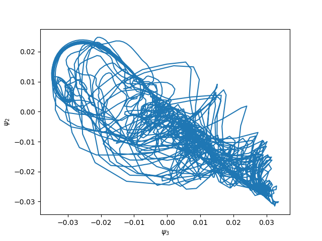
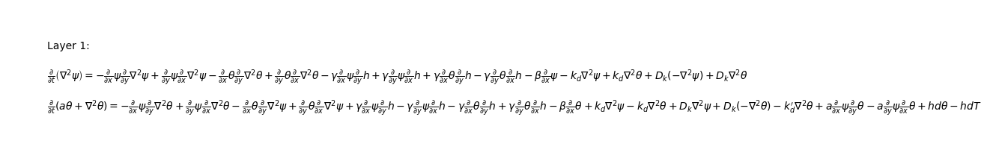
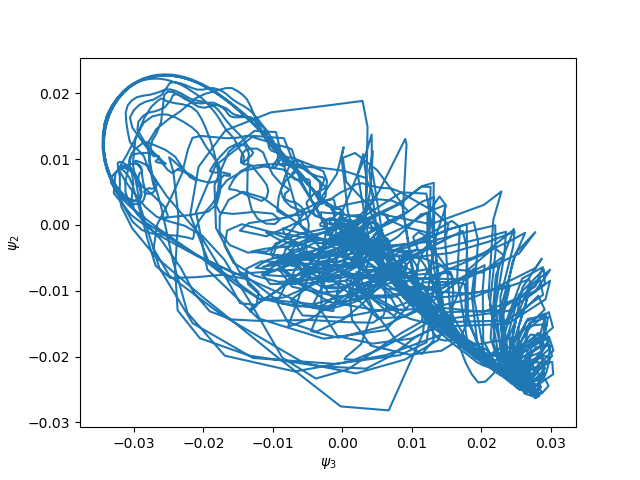

Various tricks
==============

On this page, we list several tricks on how to do this or that, related to particular aspects
of the modelling based on systems of partial differential equations.

Spatially varying parameters
----------------------------

It is possible in LayerCake to add parameters varying as a function of the coordinates.
To illustrate this, we are going to modify a spatially uniform parameter in one of the
`examples <../../../../examples/>`_, namely the
`Reinhold & Pierrehumber model <https://github.com/Climdyn/LayerCake/blob/main/examples/atmospheric/baroclinic_one_layer.py>`_ one.

In this model, two terms are representing the friction of the bottom layer with the ground:

* :math:`-\frac{k_d}{2} \nabla^2 (\psi - \theta)` for the equation involving the barotropic streamfunction :math:`\psi`
* :math:`+\frac{k_d}{2} \nabla^2 (\psi - \theta)` for the equation involving the baroclinic streamfunction :math:`\theta`

where the parameter controlling the friction is :math:`k_d`. The full equations of the model can be found `here <https://qgs.readthedocs.io/en/latest/files/model/oro_model.html#mid-layer-equations-and-the-thermal-wind-relation>`_.

Running the `LayerCake code <../../../../examples/atmospheric/baroclinic_one_layer.py>`_  produces the following figure:

which is a section of the model's attractor in the :math:`\psi_2, \psi_3` plane.

Now we can modify the original model's equations by making the parameter :math:`k_d` varies as

.. math::

    k_{d,0} + 2 \, k_{d,2} \cos(n x) \sin(y)

This can be done by using the :class:`~layercake.arithmetic.terms.operations.ProductOfTerms` objects to do the product of
a :class:`~layercake.arithmetic.terms.linear.LinearTerm` term involving a :class:`~layercake.variables.field.ParameterField` field representing
the spatial variation of the parameter, and the Laplacian terms representing :math:`\nabla^2 (\psi - \theta)`.
It can be implemented with a few lines added to the `Reinhold & Pierrehumber model code <https://github.com/Climdyn/LayerCake/blob/main/examples/atmospheric/baroclinic_one_layer.py>`_:

.. code:: ipython3

    dfriction = ProductOfTerms(LinearTerm(Dk), OperatorTerm(psi, Laplacian, atmospheric_basis.coordinate_system, sign=-1))
    dofriction = ProductOfTerms(LinearTerm(Dk), OperatorTerm(theta, Laplacian, atmospheric_basis.coordinate_system))
    barotropic_equation.add_rhs_terms([dfriction, dofriction])

in the barotropic equation and

.. code:: ipython3

    dfriction = ProductOfTerms(LinearTerm(Dk), OperatorTerm(psi, Laplacian, atmospheric_basis.coordinate_system, sign=1))
    dofriction = ProductOfTerms(LinearTerm(Dk), OperatorTerm(theta, Laplacian, atmospheric_basis.coordinate_system, sign=-1))
    baroclinic_equation.add_rhs_terms([dfriction, dofriction])

in the baroclinic equation, where :code:`Dk` is the :class:`~layercake.variables.field.ParameterField` object defining the spatial
variation of :math:`k_d`

.. code:: ipython3

    # Variable bottom friction
    dk = np.zeros(len(atmospheric_basis))
    dk[1] = 0.1 * kdp_deriv
    Dk = ParameterField('D_k', u'D_k', dk, atmospheric_basis, inner_products_definition)

with :math:`k_{d,2} = D_{k,1} = 0.1 \, k_d` (note the difference of index because of the Python-specific indexing starting from zero).
The equations LaTeX representation now clearly shows the new terms:

with the appearance of the :math:`D_k \nabla^2` terms.

The impact of this spatial variation of the bottom friction coefficient on the model's dynamics
is clearly visible on the 2-dimensional section of the attractor:

(Compare with the first figure above.)

Usage of mathematical expressions in the PDEs
---------------------------------------------

TODO

Free-threading
--------------

TODO
