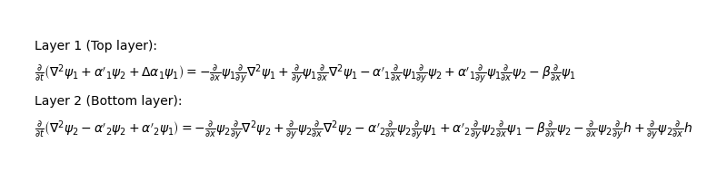
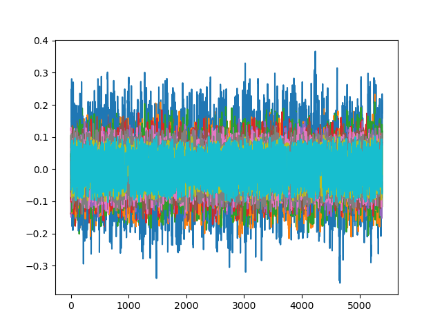

User guide
==========

This guide explains how the LayerCake framework can be used to transform a set of two-dimensional partial differential equations (PDEs)

.. math::

    \partial_t \mathcal{F}^{\mathrm LHS}_i \left[\psi_1, \ldots, \psi_N\right] = \mathcal{F}^{\mathrm{RHS}}_i \left[\psi_1, \ldots, \psi_N\right] \qquad , \quad i = 1,\ldots,N

defined on a particular domain into a system of ordinary differential equations (ODEs)
with an automated `Galerkin method`_. This method projects all the fields :math:`\psi_j` on given function basis :math:`\phi_{j,k}`:

.. math::

    \psi_j = \sum_{k=1}^{n_j} \psi_{j, k} \,\, \phi_{j,k}

and the resulting discrete representation of the spatially continuous model defined by the PDEs is sometimes called its
(truncated) representation in the spectral domain [#basis]_. The spectral coefficients :math:`\psi_{j,k}` are determined by taking a specific inner product
:math:`\langle \, , \rangle` between the fields :math:`\psi_j` and the basis of functions :math:`\phi_{j,k}`:

.. math::

    \psi_{j,k} = \left\langle \phi_{j,k} , \psi_j \right\rangle

One can also apply the inner product to the whole equations above, de facto projecting them onto subspaces spanned by the basis of functions.
This procedure results into sets of ODEs for the coefficients :math:`\psi_{j,k}`.
The goal of LayerCake is to produce numerical or symbolic representation of the tendencies of these sets of ODEs.

.. note::

    Some terminology: In LayerCake, the full system of PDEs is called the `cake`, and the system of equations can be divided
    into different subsets called `layers`.

1. Rationale behind LayerCake
-----------------------------

The ODEs resulting from the Galerkin procedure

.. math:: \dot{\boldsymbol{u}} = \boldsymbol{f}(\boldsymbol{u})

are considered to be the model that the user is looking after, and :math:`\boldsymbol{u}` is a state vector consisting
of the stacked spectral coefficients :math:`\boldsymbol{u} = (\psi_{1,1},\ldots,\psi_{1,n_1}, \ldots, \psi_{N,1},\ldots,\psi_{N,n_N})`.
The purpose of LayerCake is then to provide a Python callable or a set of strings representing
the model's tendencies :math:`\boldsymbol{f}` (and also its Jacobian matrix :math:`\boldsymbol{D f}`) that can be
used for example to

* integrate the model over time
* perform sensitivity analysis
* perform bifurcation analysis

To obtain these ODEs, the user must first specifies the PDEs system, its parameters, and its domain
(represented by a coordinate system and a set of basis functions).
In particular, the specification of the PDEs system is done by constructing each PDE one by one, adding terms to
a couple of lists representing the LHS and RHS part of the equation.
These terms are provided as :class:`~layercake.arithmetic.terms.base.ArithmeticTerms` objects representing various specific
functionals of both the fields :math:`\psi_j` of the equations and the model's static spatial fields.

2. Starting a new model
-----------------------

In general, one starts a new Python script to define a new model.
Here, we are going to detail the step of the construction of a simple model available in
the `examples/atmospheric <../../../examples/atmospheric/>`_ folder,
i.e. a two-layer quasi-geostrophic model on a `beta-plane`_ with an orography described in Vallis book :cite:`user-V2017` :

.. math::

    \partial_t \left( \nabla^2 \psi_1 + \alpha'_1 \psi_2 + (\alpha_1 - \alpha'_1) \psi_1 \right) & = & - J \left(\psi_1, \nabla^2 \psi_1\right) - J \left(\psi_1, \alpha'_1  \psi_2\right) - \beta \, \partial_x \psi_1 \\
    \partial_t \left( \nabla^2 \psi_2 + \alpha'_2 \left(\psi_1 - \psi_2 \right) \right) & = & - J \left(\psi_2, \nabla^2 \psi_2\right) - J \left(\psi_2, \alpha'_2  \psi_1\right) - \beta \, \partial_x \psi_2 - J \left(\psi_2, h\right)

where :math:`\psi_1, \psi_2` are the non-dimensional fields of the problem, and :math:`h` is the non-dimensional `orography`_ of the model.
:math:`\beta` is the non-dimensional `beta coefficient`_ and the :math:`\alpha_i, \alpha'_i` are coefficients of the model.
:math:`x` and :math:`y` are the non-dimensional coordinates on the beta-plane, and :math:`J(S,G) = \partial_x \, S \partial_y G - \partial_y S \, \partial_x G` is the Jacobian of the
fields, typically representing the advection of physical quantities (like the vorticity) in the model.
This model will be defined on a plane with as boundary conditions walls in the :math:`y` direction at the border, and periodicity in the :math:`x` direction.
This is imposed by the choice of the basis of function :math:`\phi_k`.
Each of the :math:`\phi_k`'s can be one of the three following fields:

.. math::

    &\sqrt{2}\, \cos(P_k y), \\
    &2\cos(M_k nx)\, \sin(P_k y), \\
    &2\sin(H_k nx)\, \sin(P_k y)

which are specific Fourier modes respecting these boundary conditions, and where :math:`n` is the aspect ratio of the domain, i.e. the
ratio between the :math:`x`- and :math:`y`-extend of the domain. The integers :math:`P_k` and :math:`M_k` or :math:`H_k` are the wavenumbers of the
modes. See :cite:`user-DDV2016` for more details on this kind of basis.

.. note::

    Here we will use the same basis of functions :math:`\phi_k` to decompose both the fields :math:`\psi_1` and :math:`\psi_2`, but in
    LayerCake, it is perfectly possible to decompose each field :math:`\psi_j` on its own - different - basis :math:`\phi_{j,k}`.

As a first step to implement this model in LayerCake, the script starts with the classic import of the needed classes and functions.

2.1 Importing LayerCake classes
~~~~~~~~~~~~~~~~~~~~~~~~~~~~~~~

Importing all the classes needed to specify the PDEs can be done by simply typing:

.. code:: ipython3

    # importing all that is needed to create the cake
    from layercake import *

This will import most of what is needed to build the `cake`, but a more specific import must be done to define the model's domain:

.. code:: ipython3

    # importing specific modules to create the model basis of functions
    from layercake.basis.planar_fourier import contiguous_channel_basis
    from layercake.inner_products.definition import StandardSymbolicInnerProductDefinition

where we have imported the definition of a specific basis of functions, and the standard inner product definitions for them.

2.2 Defining coordinates, parameters and fields of the model
~~~~~~~~~~~~~~~~~~~~~~~~~~~~~~~~~~~~~~~~~~~~~~~~~~~~~~~~~~~~

First, we are going to define some dimensional parameters for the model, using the dedicated :class:`~layercake.variables.parameter.Parameter` object.
To create a parameter, one need to pass it a value (which will be fixed), a |Sympy| symbol, and optionally its units:

.. code:: ipython3

    # Setting some parameters
    ##########################

    # Characteristic length scale (L_y / pi)
    L_symbol = Symbol('L')
    L = Parameter(1591549.4309189534, symbol=L_symbol, units='[m]')

    # Domain aspect ratio (this is a dimensionless parameter)
    n_symbol = Symbol('n')
    n = Parameter(1.3, symbol=n_symbol)

    # Coriolis parameter at the middle of the domain
    f0_symbol = Symbol('f_0')
    f0 = Parameter(1.032e-4, symbol=f0_symbol, units='[s^-1]')

    # Meridional gradient of the Coriolis parameter at phi_0
    beta_symbol = Symbol(u'β')
    beta = Parameter(1.3594204385792041e-11, symbol=beta_symbol, units='[m^-1][s^-1]')

    # Height of the atmospheric layers
    H1_symbol = Symbol('H_1')
    H1 = Parameter(5.2e3, symbol=H1_symbol, units='[m]')

    H2_symbol = Symbol('H_2')
    H2 = Parameter(5.2e3, symbol=H2_symbol, units='[m]')

    # Gravity
    g = Parameter(9.81, symbol=Symbol("g"), units='[m][s^-2]')

    # Reduced gravity
    gp = Parameter(float(g) * 0.6487, symbol=Symbol("g'"), units='[m][s^-2]')

We can now define derived non-dimensional parameters in the same way (note that we do not pass any :code:`units` argument here since these are dimensionless
parameters):

.. code:: ipython3

    # Derived (non-dimensional) parameters
    #######################################

    # Meridional gradient of the Coriolis parameter at phi_0
    beta_nondim = Parameter(beta * L / f0, symbol=beta_symbol)

    # Cross-terms
    alpha_1 = Parameter(f0 ** 2 * L ** 2 / (g * H1), symbol=Symbol("α_1"))
    alphap_1 = Parameter(f0 ** 2 * L ** 2 / (gp * H1), symbol=Symbol("α'_1"))
    dalpha_1 = Parameter(alpha_1 - alphap_1, symbol=Symbol("Δα_1"))
    alphap_2 = Parameter(f0 ** 2 * L ** 2 / (gp * H2), symbol=Symbol("α'_2"))

These are the :math:`\alpha_i` and :math:`\alpha'_i` coefficients encountered in the PDEs above.
We can then move to the definition of the domain, using a dedicated function :func:`~layercake.basis.planar_fourier.contiguous_channel_basis` which
create a basis object :class:`~layercake.basis.planar_fourier.PlanarChannelFourierBasis` with the right set of basis functions :math:`\phi_k` mentioned above.
The only parameter we need to pass to this function is the number of wavenumbers that we want in each direction, and the aspect ratio parameter :math:`n`
that we have previously defined:

.. code:: ipython3

    # Defining the domain
    ######################

    parameters = [n]
    atmospheric_basis = contiguous_channel_basis(2, 2, parameters)

where we ask a basis with functions up to wavenumber 2 in both :math:`x` and :math:`y` directions.
Note that this function also create directly a :class:`~layercake.variables.systems.PlanarCartesianCoordinateSystem` object for you, representing
the :math:`x, y` coordinate system of the beta plane, and embedded in the :code:`atmospheric_basis` object.
If one type :code:`atmospheric_basis` in a terminal after defining it way above, one gets the resulting basis:

.. code:: ipython3

    >>> atmospheric_basis
    [sqrt(2)*cos(y), 2*sin(y)*cos(n*x), 2*sin(y)*sin(n*x), sqrt(2)*cos(2*y), 2*sin(2*y)*cos(n*x), 2*sin(2*y)*sin(n*x), 2*sin(y)*cos(2*n*x), 2*sin(y)*sin(2*n*x), 2*sin(2*y)*cos(2*n*x), 2*sin(2*y)*sin(2*n*x)]

We also need to create an inner product definition so that LayerCake knows how you want your PDEs to be projected.
In general, using the :class:`~layercake.inner_products.definition.StandardSymbolicInnerProductDefinition` definition is sufficient for most models:

.. code:: ipython3

    # creating a inner product definition with an optimizer for trigonometric functions
    inner_products_definition = StandardSymbolicInnerProductDefinition(coordinate_system=atmospheric_basis.coordinate_system,
                                                                       optimizer='trig', kwargs={'conds': 'none'})

Note how we passed directly the coordinate system embedded in the :code:`atmospheric_basis` object created before.
To simplify the writing of the code downstream, we can also save the symbols of the coordinate system now:

.. code:: ipython3

    # coordinates
    x = atmospheric_basis.coordinate_system.coordinates_symbol_as_list[0]
    y = atmospheric_basis.coordinate_system.coordinates_symbol_as_list[1]

We can finally define the non-dimensional fields :math:`\psi_1` and :math:`\psi_2` over which the PDEs act, using the
:class:`~layercake.variables.field.Field` object:

.. code:: ipython3

    # Defining the fields
    #######################
    p1 = u'ψ_1'
    psi1 = Field("psi1", p1, atmospheric_basis, inner_products_definition, units="", latex=r'\psi_1')
    p2 = u'ψ_2'
    psi2 = Field("psi2", p2, atmospheric_basis, inner_products_definition, units="", latex=r'\psi_2')

This object creation needs a name, a |Sympy| symbol, a basis of functions (:class:`~layercake.basis.base.SymbolicBasis` object)
and an inner product definition object (:class:`~layercake.inner_products.definition.InnerProductDefinition` object). Optionally,
one can also provide units and a latex representation string (more on than below).

.. note::

    In general, if not provided, LayerCake will try to infer the latex representation string from the |Sympy| symbol of a given object.

In addition to the dynamical fields :math:`\psi_j`, the second PDE also involves a fixed spatial field :math:`h` representing the orography
of the model. Layercake represents fixed (non-dynamical) spatial fields with the :class:`~layercake.variables.field.ParameterField` in which
the fields are specified as decomposition on a given basis of functions. For example, for :math:`h`, its decomposition will be

.. math::

    h = \sum_{k=1}^{n} h_k \, \phi_k

and this translates in LayerCake as:

.. code:: ipython3

    hh = np.zeros(len(atmospheric_basis))
    hh[1] = 0.2
    h = ParameterField('h', u'h', hh, atmospheric_basis, inner_products_definition)

where we have set only :math:`h_2` different from zero, corresponding to an orography given by the field :math:`2 \, h_2 \sin(y) \cos(n x)`.
We are now ready to specify the partial differential equations and build the cake.

3. Building the cake
--------------------

To build a `cake`, one has to first specify equations (PDEs) with the :class:`~layercake.arithmetic.equation.Equation` object, then group them
into layers with the :class:`~layercake.bakery.layers.Layer` object, and finally add the layers to a :class:`~layercake.bakery.cake.Cake` object.

Let's first start by creating the equation for :math:`\psi_1`.

3.1 Defining the equations
~~~~~~~~~~~~~~~~~~~~~~~~~~

Defining an equation starts by instantiating an :class:`~layercake.arithmetic.equation.Equation` object with the terms composing its
left-hand side. In the case of the equation for :math:`\psi_1`, the left-hand side (LHS) is composed of three terms:

.. math::

    \partial_t \left( \nabla^2 \psi_1 + \alpha'_1 \psi_2 + (\alpha_1 - \alpha'_1) \psi_1 \right)

In LayerCake, all the terms in the LHS are supposed to be derived over time, so you don't have to take care of specifying this.

The first term inside the time derivative is the vorticity in the first layer, given by :math:`\nabla^2 \psi_1` where :math:`\nabla^2` is the `Laplacian`_.
In LayerCake, this is obtained by using the :class:`~layercake.arithmetic.terms.operators.Operator` term:

.. code:: ipython3

   psi1_vorticity = OperatorTerm(psi1, Laplacian, atmospheric_basis.coordinate_system)

where we have specified that we want to use the :class:`~layercake.arithmetic.symbolic.operators.Laplacian` operator.
The two remaining terms are linear in :math:`\psi_1` and :math:`\psi_2`. For this, one can use the :class:`~layercake.arithmetic.terms.linear.LinearTerm` term:

.. code:: ipython3

    dpsi12 = LinearTerm(psi2, prefactor=alphap_1)
    dpsi11 = LinearTerm(psi1, prefactor=dalpha_1)

where `prefactor` argument has been provided, yielding for example the term :math:`\alpha'_1 \psi_2` in the first case.
Now that we have created all the needed terms, we can proceed with the creation of
the :class:`~layercake.arithmetic.equation.Equation` object, providing the list of LHS terms:

.. code:: ipython3

    # defining the LHS as the time derivative of the potential vorticity
    psi1_equation = Equation(psi1, lhs_terms=[psi1_vorticity, dpsi12, dpsi11])

At this point, if one type :code:`psi1_equation` in the Python console, he would get

.. code:: ipython3

    >>> psi1_equation
    Derivative(Δα_1*ψ_1 + α'_1*ψ_2 + (D(x, x) + D(y, y))*ψ_1, t) = 0

showing the LHS. The right-hand side (RHS) of the equation is 0 as we have not yet defined it.

So let's define the RHS. First we need to add the Jacobian term responsible for the advection of the vorticity:

.. math::

   - J \left(\psi_1, \nabla^2 \psi_1\right)

with again :math:`J(S,G) = \partial_x S \, \partial_y G - \partial_y S \, \partial_x G`.
Since its form is quite complicated, it has been precoded in Layercake as a
function :class:`~layercake.arithmetic.terms.jacobian.vorticity_advection` returning the terms composing its formula:

.. code:: ipython3

   advection_term = vorticity_advection(psi1, psi1, atmospheric_basis.coordinate_system, sign=-1)

(note the negative :code:`sign` argument). Inspecting :code:`advection_term` gives us

.. code:: ipython3

    >>> advection_term
    (-D(x)*ψ_1*1*((D(y)*(D(x, x) + D(y, y)))*ψ_1),
     1*((D(y)*ψ_1)*(1*((D(x)*(D(x, x) + D(y, y)))*ψ_1))))

a tuple with the two complicated terms composing this Jacobian.
We can now add these terms directly to the RHS of our equation by typing:

.. code:: ipython3

   psi1_equation.add_rhs_terms(advection_term)

Our equation now reads

.. code:: ipython3

    >>> psi1_equation
    Derivative(Δα_1*ψ_1 + α'_1*ψ_2 + (D(x, x) + D(y, y))*ψ_1, t) = -D(x)*ψ_1*1*((D(y)*(D(x, x) + D(y, y)))*ψ_1) + (D(y)*ψ_1)*(1*((D(x)*(D(x, x) + D(y, y)))*ψ_1))

i.e. both terms have been appended on the right-hand side.

The next term to add is again a Jacobian, involving both :math:`\psi_1` and :math:`\psi_2`:

.. math::

    - J \left(\psi_1, \alpha'_1  \psi_2\right)

which again have been precoded as a function :class:`~layercake.arithmetic.terms.jacobian.Jacobian`:

.. code:: ipython3

    psi2_advec = Jacobian(psi1, psi2, atmospheric_basis.coordinate_system, sign=-1, prefactors=(alphap_1, alphap_1))
    psi1_equation.add_rhs_terms(psi2_advec)

In addition to the :code:`sign` argument, notice the :code:`prefactor` one, which allow to specify a prefactor :math:`\alpha'_1` for
each one of the term composing the formula.

The last term that we need to add to this equation is the so-called `beta term`:

.. math::

    - \beta \, \partial_x \psi_1

which can be coded as an :class:`~layercake.arithmetic.terms.operators.Operator` term:

.. code:: ipython3

    # adding the beta term
    beta_term = OperatorTerm(psi1, D, x, prefactor=beta_nondim, sign=-1)
    psi1_equation.add_rhs_term(beta_term)

and the equation is now complete, as shown by typing :code:`psi1_equation` one last time in the Python console:

.. code:: ipython3

    >>> psi1_equation
    Derivative(Δα_1*ψ_1 + α'_1*ψ_2 + (D(x, x) + D(y, y))*ψ_1, t) = ((-β)*D(x))*ψ_1 - (α'_1*D(x))*ψ_1*D(y)*ψ_2 + ((α'_1*D(y))*ψ_1)*(D(x)*ψ_2) - D(x)*ψ_1*1*((D(y)*(D(x, x) + D(y, y)))*ψ_1) + (D(y)*ψ_1)*(1*((D(x)*(D(x, x) + D(y, y)))*ψ_1))

The `"composition"` of the equation :code:`psi2_equation` for :math:`\psi_2` proceeds almost in the same way,
except that we must add a term for the orography static field :math:`h`:

.. math::

    - J \left(\psi_2, h\right)

which actually proceeds in the same way:

.. code:: ipython3

    # adding an orographic term
    orographic_term = Jacobian(psi2, h, atmospheric_basis.coordinate_system, sign=-1)
    psi2_equation.add_rhs_terms(orographic_term)

because LayerCake treats the static fields in the same way, it will not accept to take its time derivative, but any
spatial differential operator will work.

We can now move to the next step, which is to compose the layers and the cake of the model.

3.2 The layers and the cake
~~~~~~~~~~~~~~~~~~~~~~~~~~~

The remaining steps are quite easy, one needs to group the equations in subsets called layers, and then add each layer
to the `cake`.

To create a Layer, simply instantiate a :class:`~layercake.bakery.layers.Layer` object. You can optionally provide it a
name. Then you can start adding :class:`~layercake.arithmetic.equation.Equation` objects to it:

.. code:: ipython3

    # --------------------------------
    #
    #   Constructing the layer
    #
    # --------------------------------

    layer1 = Layer("Top layer")
    layer1.add_equation(psi1_equation)

    layer2 = Layer("Bottom layer")
    layer2.add_equation(psi2_equation)

Here we have created one layer per level (per PDE), but this is arbitrary and we could have created a single layer and added the
two equations to it. However, this has consequences on the way the equations are displayed later.

Once we have our layers, it is time to create the `cake`, i.e. the :class:`~layercake.bakery.cake.Cake` object, and add them to it:

.. code:: ipython3

    # --------------------------------
    #
    #   Constructing the cake
    #
    # --------------------------------

    cake = Cake()
    cake.add_layer(layer1)
    cake.add_layer(layer2)

Once this is done, the users can check that its model is complete by using the method :class:`~layercake.bakery.cake.Cake.show_latex` which
will use |Matplotlib| to show the partial differential equations in the :math:`\LaTeX` format:

.. code:: ipython3

    >>> cake.show_latex()

3.3 Computing the tensorial representation of the model
~~~~~~~~~~~~~~~~~~~~~~~~~~~~~~~~~~~~~~~~~~~~~~~~~~~~~~~

The cake regroups the layers, but also provide functions to create the tendencies of the model that the user is ultimately
looking after.

But first, before computing these tendencies, the user must first ask the `cake` to compute the tensorial representation of the tendencies.
Indeed, the tendencies :math:`\boldsymbol{f}(\boldsymbol{u})` can be expressed as:

.. math::

    f_m(\boldsymbol{u}) = \sum_{k_1,\ldots,k_R=0}^{n_\mathrm{dim}} \mathcal{T}_{m, k_1,\ldots,k_R} \, U_{k_1} \, U_{k_2} \, \ldots \, U_{k_R}

with

.. math::

    & U_0 = 1 \\
    & U_k = u_k \quad \mathrm{for} \, k=1, \ldots, n_\mathrm{dim}

and where :math:`R+1` is the maximal rank of the tensor (depending on the complexity of the terms in your PDEs) and :math:`n_\mathrm{dim} = \sum_{j=1}^N n_j` is the total dimension of
the ODEs model.
The computation of the tensor :math:`\boldsymbol{\mathcal{T}}` can be done in `numerical` or `symbolic` fashion, and this choice impacts
the kind of output that the user will get for the tendencies.

The numerical case
""""""""""""""""""

Let's first consider the `numerical` case, the tensor of
the model can be computed by calling the :class:`~layercake.bakery.cake.Cake.compute_tensor` method:

.. code:: ipython3

    # computing the tensor
    cake.compute_tensor(numerical=True, compute_inner_products=True)

where we have stated that we want the `numerical` output, and that in addition, the inner products for each term of the `cake`
must still be computed.

.. warning::

    Whether you select `numerical` or `symbolic` output, by far this is the most computationally intensive task performed by LayerCake.
    Therefore, even if the code is parallelized, depending on the model you are computing, expect this call to last a long time, between
    minutes and hours.

Once the tensor is computed, one can visualize it by calling the :class:`~layercake.bakery.cake.Cake.print_tensor` method:

.. code:: ipython3

    >>> cake.print_tensor()
    Tensor[1][0][13] =  1.52316E-01
    Tensor[1][2][13] = -7.61579E-01
    Tensor[1][3][12] =  7.61579E-01
    Tensor[1][5][16] = -6.09263E-01
    Tensor[1][6][15] =  6.09263E-01
    Tensor[1][7][18] = -1.52316E+00
    Tensor[1][8][17] =  1.52316E+00
    Tensor[1][9][20] = -1.21853E+00
    Tensor[1][10][19] =  1.21853E+00
    Tensor[2][0][3] =  9.77988E-02
    Tensor[2][0][13] =  2.27457E-02
    Tensor[2][1][3] = -9.46368E-01
    Tensor[2][1][13] =  3.50342E-01
    Tensor[2][3][11] = -3.50342E-01
    Tensor[2][4][6] = -1.51419E+00
    Tensor[2][4][16] =  5.60547E-01
    Tensor[2][5][8] = -1.44844E+00
    Tensor[2][5][18] =  4.37773E-01
    Tensor[2][6][7] =  1.44844E+00
    Tensor[2][6][14] = -5.60547E-01
    Tensor[2][6][17] = -4.37773E-01
    Tensor[2][7][16] =  4.37773E-01
    ...

where one can see entries of the rank-3 tensor of the model for :math:`u_1` and :math:`u_2`.

The symbolic case
"""""""""""""""""

Alternatively, the tensor can be computed in `symbolic` mode:

.. code:: ipython3

    # computing the tensor
    cake.compute_tensor(numerical=False, compute_inner_products=True)

.. note::

    These `symbolic` computations (integrations) are done with |Sympy| and can take an even longer time than the
    `numerical` ones. To optimize these integrations and reduce the computation time, one needs to carefully
    choose an `optimizer` for their :class:`~layercake.inner_products.definition.StandardSymbolicInnerProductDefinition`
    inner product definition. Some testing might be needed there to obtain the best solution.

Again, once the tensor is computed, one can visualize it by calling the :class:`~layercake.bakery.cake.Cake.print_tensor` method:

.. code:: ipython3

    >>> cake.print_tensor()
    Tensor[1][2][13] = 8*sqrt(2)*n*α'_1/(3*pi*(α'_1*α'_2 + (Δα_1 - 1)*(α'_2 + 1)))
    Tensor[1][3][12] = -8*sqrt(2)*n*α'_1/(3*pi*(α'_1*α'_2 + (Δα_1 - 1)*(α'_2 + 1)))
    Tensor[1][5][16] = 32*sqrt(2)*n*α'_1/(15*pi*(α'_1*α'_2 + (Δα_1 - 1)*(α'_2 + 1)))
    Tensor[1][6][15] = -32*sqrt(2)*n*α'_1/(15*pi*(α'_1*α'_2 + (Δα_1 - 1)*(α'_2 + 1)))
    Tensor[1][7][18] = 16*sqrt(2)*n*α'_1/(3*pi*(α'_1*α'_2 + (Δα_1 - 1)*(α'_2 + 1)))
    Tensor[1][8][17] = -16*sqrt(2)*n*α'_1/(3*pi*(α'_1*α'_2 + (Δα_1 - 1)*(α'_2 + 1)))
    Tensor[1][9][20] = 64*sqrt(2)*n*α'_1/(15*pi*(α'_1*α'_2 + (Δα_1 - 1)*(α'_2 + 1)))
    Tensor[1][10][19] = -64*sqrt(2)*n*α'_1/(15*pi*(α'_1*α'_2 + (Δα_1 - 1)*(α'_2 + 1)))
    Tensor[1][0][12] = 8*sqrt(2)*h_2*n*α'_1/(3*pi*(α'_1*α'_2 + (Δα_1 - 1)*(α'_2 + 1)))
    Tensor[1][0][13] = -8*sqrt(2)*h_1*n*α'_1/(3*pi*(α'_1*α'_2 + (Δα_1 - 1)*(α'_2 + 1)))
    Tensor[1][0][15] = 32*sqrt(2)*h_5*n*α'_1/(15*pi*(α'_1*α'_2 + (Δα_1 - 1)*(α'_2 + 1)))
    Tensor[1][0][16] = -32*sqrt(2)*h_4*n*α'_1/(15*pi*(α'_1*α'_2 + (Δα_1 - 1)*(α'_2 + 1)))
    Tensor[1][0][17] = 16*sqrt(2)*h_7*n*α'_1/(3*pi*(α'_1*α'_2 + (Δα_1 - 1)*(α'_2 + 1)))
    Tensor[1][0][18] = -16*sqrt(2)*h_6*n*α'_1/(3*pi*(α'_1*α'_2 + (Δα_1 - 1)*(α'_2 + 1)))
    Tensor[1][0][19] = 64*sqrt(2)*h_9*n*α'_1/(15*pi*(α'_1*α'_2 + (Δα_1 - 1)*(α'_2 + 1)))
    Tensor[1][0][20] = -64*sqrt(2)*h_8*n*α'_1/(15*pi*(α'_1*α'_2 + (Δα_1 - 1)*(α'_2 + 1)))
    Tensor[2][1][3] = 8*sqrt(2)*n**3*(n**2 + α'_2 + 1)/(3*pi*(α'_1*α'_2 - (n**2 - Δα_1 + 1)*(n**2 + α'_2 + 1)))
    Tensor[2][1][13] = 8*sqrt(2)*n*α'_1*(-n**2 - 1)/(3*pi*(α'_1*α'_2 - (n**2 - Δα_1 + 1)*(n**2 + α'_2 + 1)))
    Tensor[2][0][3] = -n*β*(n**2 + α'_2 + 1)/(α'_1*α'_2 - (n**2 - Δα_1 + 1)*(n**2 + α'_2 + 1))
    Tensor[2][3][11] = 8*sqrt(2)*n*α'_1*(n**2 + 1)/(3*pi*(α'_1*α'_2 - (n**2 - Δα_1 + 1)*(n**2 + α'_2 + 1)))
    Tensor[2][4][6] = 64*sqrt(2)*n**3*(n**2 + α'_2 + 1)/(15*pi*(α'_1*α'_2 - (n**2 - Δα_1 + 1)*(n**2 + α'_2 + 1)))
    Tensor[2][4][16] = 64*sqrt(2)*n*α'_1*(-n**2 - 1)/(15*pi*(α'_1*α'_2 - (n**2 - Δα_1 + 1)*(n**2 + α'_2 + 1)))
    Tensor[2][5][8] = 9*n*(n**2 - 1)*(n**2 + α'_2 + 1)/(2*(α'_1*α'_2 - (n**2 - Δα_1 + 1)*(n**2 + α'_2 + 1)))
    Tensor[2][5][18] = 3*n*α'_1*(-n**2 - 1)/(2*(α'_1*α'_2 - (n**2 - Δα_1 + 1)*(n**2 + α'_2 + 1)))
    ...

where one can see the symbolic entries of the rank-3 tensor of the model for :math:`u_1` and :math:`u_2`, each of
them being a |Sympy| analytic expression.

Now that we have computed the tensorial representation of the tendencies, we can move to the last remaining task:
actually obtaining the tendencies of the model.

3.4 Getting the tendencies of the model
~~~~~~~~~~~~~~~~~~~~~~~~~~~~~~~~~~~~~~~

Whether you choose to compute the model's tensor in `numerical` or `symbolic` mode, a single method of
the cake will provide you the tendencies: :class:`~layercake.bakery.cake.Cake.compute_tendencies`.

Numerical case
""""""""""""""

In the `numerical` case, if you do not pass any argument to this function, it will return you two |Numba| callables:

.. code:: ipython3

    # computing the tendencies
    f, Df = cake.compute_tendencies()

These two callables are functions providing the tendencies and the model's Jacobian matrix, respectively.
One can quickly check:

.. code:: ipython3

    >>> import numpy as np
    >>> v = np.random.randn(cake.ndim) * 0.1
    >>> f(0., v)  # returned callable have the signature f(t, x)
    array([-0.00667625,  0.01512935, -0.00770229, -0.01693585, -0.01345779,
            0.00881044,  0.04845124,  0.03311804, -0.02852608, -0.02710614,
           -0.00020961, -0.00777624, -0.00517924,  0.01353255,  0.00820175,
           -0.00030608,  0.02262187,  0.0026052 , -0.00895037, -0.0121839 ])
    >>> Df(0., v)
    array([[ 0.        ,  0.00818696,  0.10304596,  0.        , -0.02305965,
             0.04599406, -0.06220774, -0.07241634,  0.0313725 ,  0.03121731,
             0.        ,  0.00657654,  0.19267401,  0.        , -0.0439524 ,
             0.04455718,  0.10830466,  0.00442589, -0.07972091, -0.12225232],
           [-0.01193843,  0.        ,  0.19675808,  0.13044971, -0.08511269,
            -0.14923926, -0.08792191,  0.07288066,  0.        ,  0.        ,
            ...

A typical usage of the first callable would be to get the time evolution of the model by solving the
ODEs :math:`\dot{\boldsymbol{u}} = \boldsymbol{f}(\boldsymbol{u})`:

.. code:: ipython3

    >>> # integrating
    >>> from scipy.integrate import solve_ivp
    >>> # a transient first
    >>> ic = np.random.rand(cake.ndim) * 0.1
    >>> res = solve_ivp(f, (0., 20000.), ic, method='DOP853')
    >>> # then getting a trajectory on the model's attractor
    >>> ic = res.y[:, -1]
    >>> res = solve_ivp(f, (0., 20000.), ic, method='DOP853')

using :obj:`scipy.integrate.solve_ivp`. The result can the plotted using |Matplotlib|:

.. code:: ipython3

    >>> # plotting
    >>> import matplotlib.pyplot as plt
    >>> plt.plot(res.y.T)
    >>> plt.show()

    A plot of the model's variables :math:`u_i` as a function  of the non-dimensional time.

The function :code:`Df` returning the Jacobian matrix can also be used to perform sensitivity analysis or compute the
Lyapunov exponents (see for example :cite:`user-KP2012`).

Finally, one may be interested to get a strings representation of the tendencies and the Jacobian matrix, instead of callables.
LayerCake permits this through the :class:`~layercake.bakery.cake.Cake.compute_tendencies` function argument :code:`force_symbolic_output`:

.. code:: ipython3

    >>> f, Df = cake.compute_tendencies(language='fortran', force_symbolic_output=True)
    >>> f
    (['F(1) = +0.152315867110767 * U(13) -0.761579335553835 * U(2) * U(13) +0.761579335553835 * U(3) * U(12) -0.609263468443069 * U(5) * U(16) +0.609263468443069 * U(6) * U(15) -1.52315867110767 * U(7) * U(18) +1.52315867110767 * U(8) * U(17) -1.21852693688614 * U(9) * U(20) +1.21852693688614 * U(10) * U(19) ',
      'F(2) = +0.0977988436180626 * U(3) +0.0227457285208521 * U(13) -0.946368011642339 * U(1) * U(3) +0.350341640515348 * U(1) * U(13) -0.350341640515348 * U(3) * U(11) -1.51418881862774 * U(4) * U(6) +0.560546624824558 * U(4) * U(16) -1.44844195086269 * U(5) * U(8) +0.437773189829640 * U(5) * U(18) +1.44844195086269 * U(6) * U(7) -0.560546624824558 * U(6) * U(14) -0.437773189829640 * U(6) * U(17) +0.437773189829640 * U(7) * U(16) -0.437773189829640 * U(8) * U(15) -0.220103112442728 * U(11) * U(13) -0.352164979908365 * U(14) * U(16) -0.336873792917233 * U(15) * U(18) +0.336873792917233 * U(16) * U(17) ',
      'F(3) = -0.0977988436180626 * U(2) -0.0260477056145241 * U(11) -0.0227457285208521 * U(12) +0.946368011642339 * U(1) * U(2) -0.350341640515348 * U(1) * U(12) +0.350341640515348 * U(2) * U(11) +1.51418881862774 * U(4) * U(5) -0.560546624824558 * U(4) * U(15) +1.44844195086269 * U(5) * U(7) +0.560546624824558 * U(5) * U(14) -0.437773189829640 * U(5) * U(17) +1.44844195086269 * U(6) * U(8) -0.437773189829640 * U(6) * U(18) +0.437773189829640 * U(7) * U(15) +0.437773189829640 * U(8) * U(16) +0.220103112442728 * U(11) * U(12) +0.352164979908366 * U(14) * U(15) +0.336873792917233 * U(15) * U(17) +0.336873792917233 * U(16) * U(18) ',
      'F(4) = +0.0203805316308601 * U(16) +1.80568065763592 * U(2) * U(6) -0.407610632617202 * U(2) * U(16) -1.80568065763592 * U(3) * U(5) +0.407610632617201 * U(3) * U(15) -0.407610632617201 * U(5) * U(13) +0.407610632617202 * U(6) * U(12) +3.61136131527183 * U(7) * U(10) -0.815221265234403 * U(7) * U(20) -3.61136131527184 * U(8) * U(9) +0.815221265234403 * U(8) * U(19) -0.815221265234403 * U(9) * U(18) +0.815221265234403 * U(10) * U(17) +0.305707974462902 * U(12) * U(16) -0.305707974462902 * U(13) * U(15) +0.611415948925803 * U(17) * U(20) -0.611415948925804 * U(18) * U(19) ',
      'F(5) = +0.0463966743239754 * U(6) +0.00581443067112114 * U(16) +0.00832020873249573 * U(18) -0.996757034674914 * U(1) * U(6) +0.151547605172358 * U(1) * U(16) +1.68302993542182 * U(2) * U(8) -0.236709938439503 * U(2) * U(18) +0.556823759242703 * U(3) * U(4) -1.68302993542182 * U(3) * U(7) -0.303095210344717 * U(3) * U(14) +0.236709938439503 * U(3) * U(17) +0.303095210344717 * U(4) * U(13) -0.151547605172358 * U(6) * U(11) -0.236709938439503 * U(7) * U(13) +0.236709938439503 * U(8) * U(12) -0.124913579658763 * U(11) * U(16) +0.210917291368767 * U(12) * U(18) +0.0697811468456203 * U(13) * U(14) -0.210917291368767 * U(13) * U(17) ',
      'F(6) = -0.0463966743239754 * U(5) -0.0106536102054382 * U(14) -0.00581443067112115 * U(15) -0.00832020873249574 * U(17) +0.996757034674915 * U(1) * U(5) -0.151547605172358 * U(1) * U(15) -0.556823759242703 * U(2) * U(4) -1.68302993542183 * U(2) * U(7) +0.303095210344717 * U(2) * U(14) +0.236709938439503 * U(2) * U(17) -1.68302993542183 * U(3) * U(8) +0.236709938439503 * U(3) * U(18) -0.303095210344717 * U(4) * U(12) +0.151547605172358 * U(5) * U(11) -0.236709938439503 * U(7) * U(12) -0.236709938439503 * U(8) * U(13) +0.124913579658763 * U(11) * U(15) -0.0697811468456204 * U(12) * U(14) -0.210917291368767 * U(12) * U(17) -0.210917291368767 * U(13) * U(18) ',
      'F(7) = +0.0684021570329956 * U(8) +0.00465269033883484 * U(16) +0.00650290065529055 * U(18) -2.64762285313595 * U(1) * U(8) +0.288940532287797 * U(1) * U(18) +0.734104837332769 * U(2) * U(6) -0.180524385146792 * U(2) * U(16) +0.734104837332770 * U(3) * U(5) -0.180524385146791 * U(3) * U(15) -4.23619656501753 * U(4) * U(10) +0.462304851660476 * U(4) * U(20) +0.180524385146791 * U(5) * U(13) +0.180524385146792 * U(6) * U(12) -0.288940532287797 * U(8) * U(11) -0.462304851660476 * U(10) * U(14) -0.251705927611535 * U(11) * U(18) +0.0697903550825226 * U(12) * U(16) +0.0697903550825226 * U(13) * U(15) -0.402729484178456 * U(14) * U(20) ',
      'F(8) = -0.0684021570329956 * U(7) -0.00465269033883484 * U(15) -0.00650290065529055 * U(17) +2.64762285313595 * U(1) * U(7) -0.288940532287797 * U(1) * U(17) -0.734104837332769 * U(2) * U(5) +0.180524385146792 * U(2) * U(15) +0.734104837332769 * U(3) * U(6) -0.180524385146792 * U(3) * U(16) +4.23619656501753 * U(4) * U(9) -0.462304851660476 * U(4) * U(19) -0.180524385146792 * U(5) * U(12) +0.180524385146792 * U(6) * U(13) +0.288940532287797 * U(7) * U(11) +0.462304851660476 * U(9) * U(14) +0.251705927611535 * U(11) * U(17) -0.0697903550825225 * U(12) * U(15) +0.0697903550825225 * U(13) * U(16) +0.402729484178456 * U(14) * U(19) ',
      'F(9) = +0.0496032755441112 * U(10) +0.00349352540983830 * U(20) -2.21763357683572 * U(1) * U(10) +0.172189154146321 * U(1) * U(20) -1.70866849362752 * U(4) * U(8) +0.344378308292642 * U(4) * U(18) -0.344378308292642 * U(8) * U(14) -0.172189154146321 * U(10) * U(11) -0.156186444653169 * U(11) * U(20) -0.120340375388507 * U(14) * U(18) ',
      'F(10) = -0.0496032755441112 * U(9) -0.00349352540983830 * U(19) +2.21763357683572 * U(1) * U(9) -0.172189154146321 * U(1) * U(19) +1.70866849362752 * U(4) * U(7) -0.344378308292642 * U(4) * U(17) +0.344378308292642 * U(7) * U(14) +0.172189154146321 * U(9) * U(11) +0.156186444653169 * U(11) * U(19) +0.120340375388507 * U(14) * U(17) ',
      'F(11) = +0.240345070655759 * U(13) +0.358822928060187 * U(2) * U(13) -0.358822928060187 * U(3) * U(12) +0.287058342448150 * U(5) * U(16) -0.287058342448150 * U(6) * U(15) +0.717645856120375 * U(7) * U(18) -0.717645856120375 * U(8) * U(17) +0.574116684896300 * U(9) * U(20) -0.574116684896300 * U(10) * U(19) ',
      'F(12) = +0.0227457285208521 * U(3) +0.0830436895265858 * U(13) -0.220103112442728 * U(1) * U(3) -0.281465819921236 * U(1) * U(13) +0.281465819921236 * U(3) * U(11) -0.352164979908365 * U(4) * U(6) -0.450345311873978 * U(4) * U(16) -0.336873792917233 * U(5) * U(8) -0.351708662532042 * U(5) * U(18) +0.336873792917233 * U(6) * U(7) +0.450345311873978 * U(6) * U(14) +0.351708662532042 * U(6) * U(17) -0.351708662532042 * U(7) * U(16) +0.351708662532042 * U(8) * U(15) -0.803587122600741 * U(11) * U(13) -1.28573939616118 * U(14) * U(16) -1.22991192139728 * U(15) * U(18) +1.22991192139728 * U(16) * U(17) ',
      'F(13) = -0.0227457285208521 * U(2) -0.0950990677634013 * U(11) -0.0830436895265858 * U(12) +0.220103112442728 * U(1) * U(2) +0.281465819921236 * U(1) * U(12) -0.281465819921236 * U(2) * U(11) +0.352164979908366 * U(4) * U(5) +0.450345311873978 * U(4) * U(15) +0.336873792917233 * U(5) * U(7) -0.450345311873978 * U(5) * U(14) +0.351708662532042 * U(5) * U(17) +0.336873792917233 * U(6) * U(8) +0.351708662532042 * U(6) * U(18) -0.351708662532042 * U(7) * U(15) -0.351708662532042 * U(8) * U(16) +0.803587122600741 * U(11) * U(12) +1.28573939616119 * U(14) * U(15) +1.22991192139728 * U(15) * U(17) +1.22991192139728 * U(16) * U(18) ',
      'F(14) = +0.107157859640122 * U(16) +0.305707974462902 * U(2) * U(6) +0.353720057339929 * U(2) * U(16) -0.305707974462902 * U(3) * U(5) -0.353720057339929 * U(3) * U(15) +0.353720057339929 * U(5) * U(13) -0.353720057339929 * U(6) * U(12) +0.611415948925803 * U(7) * U(10) +0.707440114679858 * U(7) * U(20) -0.611415948925804 * U(8) * U(9) -0.707440114679858 * U(8) * U(19) +0.707440114679858 * U(9) * U(18) -0.707440114679858 * U(10) * U(17) +1.60736789460183 * U(12) * U(16) -1.60736789460183 * U(13) * U(15) +3.21473578920367 * U(17) * U(20) -3.21473578920367 * U(18) * U(19) ',
      'F(15) = +0.00581443067112114 * U(6) +0.0426248531476191 * U(16) +0.0609943940240988 * U(18) -0.124913579658763 * U(1) * U(6) -0.137462369488870 * U(1) * U(16) +0.210917291368767 * U(2) * U(8) +0.214709490014387 * U(2) * U(18) +0.0697811468456203 * U(3) * U(4) -0.210917291368767 * U(3) * U(7) +0.274924738977741 * U(3) * U(14) -0.214709490014387 * U(3) * U(17) -0.274924738977741 * U(4) * U(13) +0.137462369488870 * U(6) * U(11) +0.214709490014387 * U(7) * U(13) -0.214709490014387 * U(8) * U(12) -0.915725595550275 * U(11) * U(16) +1.54620788851091 * U(12) * U(18) +0.511556729283949 * U(13) * U(14) -1.54620788851091 * U(13) * U(17) ',
      'F(16) = -0.00581443067112115 * U(5) -0.0781002640128166 * U(14) -0.0426248531476191 * U(15) -0.0609943940240989 * U(17) +0.124913579658763 * U(1) * U(5) +0.137462369488870 * U(1) * U(15) -0.0697811468456204 * U(2) * U(4) -0.210917291368767 * U(2) * U(7) -0.274924738977741 * U(2) * U(14) -0.214709490014387 * U(2) * U(17) -0.210917291368767 * U(3) * U(8) -0.214709490014387 * U(3) * U(18) +0.274924738977741 * U(4) * U(12) -0.137462369488870 * U(5) * U(11) +0.214709490014387 * U(7) * U(12) +0.214709490014387 * U(8) * U(13) +0.915725595550275 * U(11) * U(15) -0.511556729283949 * U(12) * U(14) -1.54620788851091 * U(12) * U(17) -1.54620788851091 * U(13) * U(18) ',
      'F(17) = +0.00650290065529055 * U(8) +0.0459221222660491 * U(16) +0.0641837253779086 * U(18) -0.251705927611535 * U(1) * U(8) -0.269249247461966 * U(1) * U(18) +0.0697903550825226 * U(2) * U(6) +0.168221656077293 * U(2) * U(16) +0.0697903550825226 * U(3) * U(5) +0.168221656077293 * U(3) * U(15) -0.402729484178456 * U(4) * U(10) -0.430798795939146 * U(4) * U(20) -0.168221656077293 * U(5) * U(13) -0.168221656077293 * U(6) * U(12) +0.269249247461966 * U(8) * U(11) +0.430798795939146 * U(10) * U(14) -2.48434121789435 * U(11) * U(18) +0.688831833990737 * U(12) * U(16) +0.688831833990737 * U(13) * U(15) -3.97494594863096 * U(14) * U(20) ',
      'F(18) = -0.00650290065529055 * U(7) -0.0459221222660492 * U(15) -0.0641837253779086 * U(17) +0.251705927611535 * U(1) * U(7) +0.269249247461966 * U(1) * U(17) -0.0697903550825225 * U(2) * U(5) -0.168221656077293 * U(2) * U(15) +0.0697903550825225 * U(3) * U(6) +0.168221656077293 * U(3) * U(16) +0.402729484178456 * U(4) * U(9) +0.430798795939146 * U(4) * U(19) +0.168221656077293 * U(5) * U(12) -0.168221656077293 * U(6) * U(13) -0.269249247461966 * U(7) * U(11) -0.430798795939146 * U(9) * U(14) +2.48434121789435 * U(11) * U(17) -0.688831833990737 * U(12) * U(15) +0.688831833990737 * U(13) * U(16) +3.97494594863096 * U(14) * U(19) ',
      'F(19) = +0.00349352540983830 * U(10) +0.0473370256107490 * U(20) -0.156186444653169 * U(1) * U(10) -0.163726222597713 * U(1) * U(20) -0.120340375388507 * U(4) * U(8) -0.327452445195426 * U(4) * U(18) +0.327452445195426 * U(8) * U(14) +0.163726222597713 * U(10) * U(11) -2.11631543018921 * U(11) * U(20) -1.63060369211300 * U(14) * U(18) ',
      'F(20) = -0.00349352540983830 * U(9) -0.0473370256107491 * U(19) +0.156186444653169 * U(1) * U(9) +0.163726222597713 * U(1) * U(19) +0.120340375388507 * U(4) * U(7) +0.327452445195426 * U(4) * U(17) -0.327452445195426 * U(7) * U(14) -0.163726222597713 * U(9) * U(11) +2.11631543018921 * U(11) * U(19) +1.63060369211300 * U(14) * U(17) '],
     set())
    >>> Df
    (['J(1,2) = -0.761579335553835 * U(13) ',
      'J(1,3) = +0.761579335553835 * U(12) ',
      'J(1,5) = -0.609263468443069 * U(16) ',
      'J(1,6) = +0.609263468443069 * U(15) ',
      'J(1,7) = -1.52315867110767 * U(18) ',
      'J(1,8) = +1.52315867110767 * U(17) ',
      'J(1,9) = -1.21852693688614 * U(20) ',
      'J(1,10) = +1.21852693688614 * U(19) ',
      'J(1,12) = +0.761579335553835 * U(3) ',
      'J(1,13) = +0.152315867110767 -0.761579335553835 * U(2) ',
      'J(1,15) = +0.609263468443069 * U(6) ',
      'J(1,16) = -0.609263468443069 * U(5) ',
      'J(1,17) = +1.52315867110767 * U(8) ',
      'J(1,18) = -1.52315867110767 * U(7) ',
      'J(1,19) = +1.21852693688614 * U(10) ',
      'J(1,20) = -1.21852693688614 * U(9) ',
      'J(2,1) = -0.946368011642339 * U(3) +0.350341640515348 * U(13) ',
      'J(2,3) = +0.0977988436180626 -0.946368011642339 * U(1) -0.350341640515348 * U(11) ',
      'J(2,4) = -1.51418881862774 * U(6) +0.560546624824558 * U(16) ',
      'J(2,5) = -1.44844195086269 * U(8) +0.437773189829640 * U(18) ',
      'J(2,6) = -1.51418881862774 * U(4) +1.44844195086269 * U(7) -0.560546624824558 * U(14) -0.437773189829640 * U(17) ',
      'J(2,7) = +1.44844195086269 * U(6) +0.437773189829640 * U(16) ',
      'J(2,8) = -1.44844195086269 * U(5) -0.437773189829640 * U(15) ',
      ...

where the :code:`U(i)` refers to the components :math:`U_i` defined at the beginning of
section :ref:`files/user_guide:3.3 computing the tensorial representation of the model`.

This functionality is particularly useful to get the resulting functions with another language, or to save it in plain text.
Here we asked the outputs formatted in Fortran, but it is also possible to output the functions definition in Python or Julia.
See the documentation of the function :class:`~layercake.bakery.cake.Cake.compute_tendencies` for more details.

Symbolic case
"""""""""""""

In the `symbolic` case, the function :class:`~layercake.bakery.cake.Cake.compute_tendencies` will return
a strings representation of the tendencies and the Jacobian matrix, i.e. a list of strings with analytical formula,
one per tendencies or Jacobian matrix component.

Typical (optional) arguments to this function are the :code:`language` of the returned tendencies formula (presently Fortran,
Julia and Python are available), but also :code:`lang_translation` which is a dictionary holding
additional language translation mapping provided by the user, i.e. mapping replacements for converting
|Sympy| symbolic output strings to the target language.

Here, let's ask for the Fortran language output:

.. code:: ipython3

    # computing the tendencies
    f, Df = cake.compute_tendencies(language='fortran')  # if not provided, 'python' is the default language

which returns

.. code:: ipython3

    >>> f
    (["F(1) = +8*sqrt(2)*h_2*n*α'_1/(3*pi*(α'_1*α'_2 + (Δα_1 - 1)*(α'_2 + 1))) * U(12) -8*sqrt(2)*h_1*n*α'_1/(3*pi*(α'_1*α'_2 + (Δα_1 - 1)*(α'_2 + 1))) * U(13) +32*sqrt(2)*h_5*n*α'_1/(15*pi*(α'_1*α'_2 + (Δα_1 - 1)*(α'_2 + 1))) * U(15) -32*sqrt(2)*h_4*n*α'_1/(15*pi*(α'_1*α'_2 + (Δα_1 - 1)*(α'_2 + 1))) * U(16) +16*sqrt(2)*h_7*n*α'_1/(3*pi*(α'_1*α'_2 + (Δα_1 - 1)*(α'_2 + 1))) * U(17) -16*sqrt(2)*h_6*n*α'_1/(3*pi*(α'_1*α'_2 + (Δα_1 - 1)*(α'_2 + 1))) * U(18) +64*sqrt(2)*h_9*n*α'_1/(15*pi*(α'_1*α'_2 + (Δα_1 - 1)*(α'_2 + 1))) * U(19) -64*sqrt(2)*h_8*n*α'_1/(15*pi*(α'_1*α'_2 + (Δα_1 - 1)*(α'_2 + 1))) * U(20) +8*sqrt(2)*n*α'_1/(3*pi*(α'_1*α'_2 + (Δα_1 - 1)*(α'_2 + 1))) * U(2) * U(13) -8*sqrt(2)*n*α'_1/(3*pi*(α'_1*α'_2 + (Δα_1 - 1)*(α'_2 + 1))) * U(3) * U(12) +32*sqrt(2)*n*α'_1/(15*pi*(α'_1*α'_2 + (Δα_1 - 1)*(α'_2 + 1))) * U(5) * U(16) -32*sqrt(2)*n*α'_1/(15*pi*(α'_1*α'_2 + (Δα_1 - 1)*(α'_2 + 1))) * U(6) * U(15) +16*sqrt(2)*n*α'_1/(3*pi*(α'_1*α'_2 + (Δα_1 - 1)*(α'_2 + 1))) * U(7) * U(18) -16*sqrt(2)*n*α'_1/(3*pi*(α'_1*α'_2 + (Δα_1 - 1)*(α'_2 + 1))) * U(8) * U(17) +64*sqrt(2)*n*α'_1/(15*pi*(α'_1*α'_2 + (Δα_1 - 1)*(α'_2 + 1))) * U(9) * U(20) -64*sqrt(2)*n*α'_1/(15*pi*(α'_1*α'_2 + (Δα_1 - 1)*(α'_2 + 1))) * U(10) * U(19) ",
      "F(2) = -n*β*(n**2 + α'_2 + 1)/(α'_1*α'_2 - (n**2 - Δα_1 + 1)*(n**2 + α'_2 + 1)) * U(3) -8*sqrt(2)*h_2*n*α'_1/(3*pi*(α'_1*α'_2 - (n**2 - Δα_1 + 1)*(n**2 + α'_2 + 1))) * U(11) +α'_1*(8*sqrt(2)*h_0*n/(3*pi) - n*β)/(α'_1*α'_2 - (n**2 - Δα_1 + 1)*(n**2 + α'_2 + 1)) * U(13) -64*sqrt(2)*h_5*n*α'_1/(15*pi*(α'_1*α'_2 - (n**2 - Δα_1 + 1)*(n**2 + α'_2 + 1))) * U(14) -3*h_7*n*α'_1/(2*(α'_1*α'_2 - (n**2 - Δα_1 + 1)*(n**2 + α'_2 + 1))) * U(15) +α'_1*(64*sqrt(2)*h_3*n/(15*pi) + 3*h_6*n/2)/(α'_1*α'_2 - (n**2 - Δα_1 + 1)*(n**2 + α'_2 + 1)) * U(16) -3*h_5*n*α'_1/(2*(α'_1*α'_2 - (n**2 - Δα_1 + 1)*(n**2 + α'_2 + 1))) * U(17) +3*h_4*n*α'_1/(2*(α'_1*α'_2 - (n**2 - Δα_1 + 1)*(n**2 + α'_2 + 1))) * U(18) +8*sqrt(2)*n**3*(n**2 + α'_2 + 1)/(3*pi*(α'_1*α'_2 - (n**2 - Δα_1 + 1)*(n**2 + α'_2 + 1))) * U(1) * U(3) +8*sqrt(2)*n*α'_1*(-n**2 - 1)/(3*pi*(α'_1*α'_2 - (n**2 - Δα_1 + 1)*(n**2 + α'_2 + 1))) * U(1) * U(13) +8*sqrt(2)*n*α'_1*(n**2 + 1)/(3*pi*(α'_1*α'_2 - (n**2 - Δα_1 + 1)*(n**2 + α'_2 + 1))) * U(3) * U(11) +64*sqrt(2)*n**3*(n**2 + α'_2 + 1)/(15*pi*(α'_1*α'_2 - (n**2 - Δα_1 + 1)*(n**2 + α'_2 + 1))) * U(4) * U(6) +64*sqrt(2)*n*α'_1*(-n**2 - 1)/(15*pi*(α'_1*α'_2 - (n**2 - Δα_1 + 1)*(n**2 + α'_2 + 1))) * U(4) * U(16) +9*n*(n**2 - 1)*(n**2 + α'_2 + 1)/(2*(α'_1*α'_2 - (n**2 - Δα_1 + 1)*(n**2 + α'_2 + 1))) * U(5) * U(8) +3*n*α'_1*(-n**2 - 1)/(2*(α'_1*α'_2 - (n**2 - Δα_1 + 1)*(n**2 + α'_2 + 1))) * U(5) * U(18) +9*n*(1 - n**2)*(n**2 + α'_2 + 1)/(2*(α'_1*α'_2 - (n**2 - Δα_1 + 1)*(n**2 + α'_2 + 1))) * U(6) * U(7) +64*sqrt(2)*n*α'_1*(n**2 + 1)/(15*pi*(α'_1*α'_2 - (n**2 - Δα_1 + 1)*(n**2 + α'_2 + 1))) * U(6) * U(14) +3*n*α'_1*(n**2 + 1)/(2*(α'_1*α'_2 - (n**2 - Δα_1 + 1)*(n**2 + α'_2 + 1))) * U(6) * U(17) +3*n*α'_1*(-n**2 - 1)/(2*(α'_1*α'_2 - (n**2 - Δα_1 + 1)*(n**2 + α'_2 + 1))) * U(7) * U(16) +3*n*α'_1*(n**2 + 1)/(2*(α'_1*α'_2 - (n**2 - Δα_1 + 1)*(n**2 + α'_2 + 1))) * U(8) * U(15) +8*sqrt(2)*n**3*α'_1/(3*pi*(α'_1*α'_2 - (n**2 - Δα_1 + 1)*(n**2 + α'_2 + 1))) * U(11) * U(13) +64*sqrt(2)*n**3*α'_1/(15*pi*(α'_1*α'_2 - (n**2 - Δα_1 + 1)*(n**2 + α'_2 + 1))) * U(14) * U(16) +9*n*α'_1*(n**2 - 1)/(2*(α'_1*α'_2 - (n**2 - Δα_1 + 1)*(n**2 + α'_2 + 1))) * U(15) * U(18) +9*n*α'_1*(1 - n**2)/(2*(α'_1*α'_2 - (n**2 - Δα_1 + 1)*(n**2 + α'_2 + 1))) * U(16) * U(17) ",
      "F(3) = +n*β*(n**2 + α'_2 + 1)/(α'_1*α'_2 - (n**2 - Δα_1 + 1)*(n**2 + α'_2 + 1)) * U(2) +8*sqrt(2)*h_1*n*α'_1/(3*pi*(α'_1*α'_2 - (n**2 - Δα_1 + 1)*(n**2 + α'_2 + 1))) * U(11) +α'_1*(-8*sqrt(2)*h_0*n/(3*pi) + n*β)/(α'_1*α'_2 - (n**2 - Δα_1 + 1)*(n**2 + α'_2 + 1)) * U(12) +64*sqrt(2)*h_4*n*α'_1/(15*pi*(α'_1*α'_2 - (n**2 - Δα_1 + 1)*(n**2 + α'_2 + 1))) * U(14) +α'_1*(-64*sqrt(2)*h_3*n/(15*pi) + 3*h_6*n/2)/(α'_1*α'_2 - (n**2 - Δα_1 + 1)*(n**2 + α'_2 + 1)) * U(15) +3*h_7*n*α'_1/(2*(α'_1*α'_2 - (n**2 - Δα_1 + 1)*(n**2 + α'_2 + 1))) * U(16) -3*h_4*n*α'_1/(2*(α'_1*α'_2 - (n**2 - Δα_1 + 1)*(n**2 + α'_2 + 1))) * U(17) -3*h_5*n*α'_1/(2*(α'_1*α'_2 - (n**2 - Δα_1 + 1)*(n**2 + α'_2 + 1))) * U(18) -8*sqrt(2)*n**3*(n**2 + α'_2 + 1)/(3*pi*(α'_1*α'_2 - (n**2 - Δα_1 + 1)*(n**2 + α'_2 + 1))) * U(1) * U(2) +8*sqrt(2)*n*α'_1*(n**2 + 1)/(3*pi*(α'_1*α'_2 - (n**2 - Δα_1 + 1)*(n**2 + α'_2 + 1))) * U(1) * U(12) +8*sqrt(2)*n*α'_1*(-n**2 - 1)/(3*pi*(α'_1*α'_2 - (n**2 - Δα_1 + 1)*(n**2 + α'_2 + 1))) * U(2) * U(11) -64*sqrt(2)*n**3*(n**2 + α'_2 + 1)/(15*pi*(α'_1*α'_2 - (n**2 - Δα_1 + 1)*(n**2 + α'_2 + 1))) * U(4) * U(5) +64*sqrt(2)*n*α'_1*(n**2 + 1)/(15*pi*(α'_1*α'_2 - (n**2 - Δα_1 + 1)*(n**2 + α'_2 + 1))) * U(4) * U(15) +9*n*(1 - n**2)*(n**2 + α'_2 + 1)/(2*(α'_1*α'_2 - (n**2 - Δα_1 + 1)*(n**2 + α'_2 + 1))) * U(5) * U(7) +64*sqrt(2)*n*α'_1*(-n**2 - 1)/(15*pi*(α'_1*α'_2 - (n**2 - Δα_1 + 1)*(n**2 + α'_2 + 1))) * U(5) * U(14) +3*n*α'_1*(n**2 + 1)/(2*(α'_1*α'_2 - (n**2 - Δα_1 + 1)*(n**2 + α'_2 + 1))) * U(5) * U(17) +9*n*(1 - n**2)*(n**2 + α'_2 + 1)/(2*(α'_1*α'_2 - (n**2 - Δα_1 + 1)*(n**2 + α'_2 + 1))) * U(6) * U(8) +3*n*α'_1*(n**2 + 1)/(2*(α'_1*α'_2 - (n**2 - Δα_1 + 1)*(n**2 + α'_2 + 1))) * U(6) * U(18) +3*n*α'_1*(-n**2 - 1)/(2*(α'_1*α'_2 - (n**2 - Δα_1 + 1)*(n**2 + α'_2 + 1))) * U(7) * U(15) +3*n*α'_1*(-n**2 - 1)/(2*(α'_1*α'_2 - (n**2 - Δα_1 + 1)*(n**2 + α'_2 + 1))) * U(8) * U(16) -8*sqrt(2)*n**3*α'_1/(3*pi*(α'_1*α'_2 - (n**2 - Δα_1 + 1)*(n**2 + α'_2 + 1))) * U(11) * U(12) -64*sqrt(2)*n**3*α'_1/(15*pi*(α'_1*α'_2 - (n**2 - Δα_1 + 1)*(n**2 + α'_2 + 1))) * U(14) * U(15) +9*n*α'_1*(1 - n**2)/(2*(α'_1*α'_2 - (n**2 - Δα_1 + 1)*(n**2 + α'_2 + 1))) * U(15) * U(17) +9*n*α'_1*(1 - n**2)/(2*(α'_1*α'_2 - (n**2 - Δα_1 + 1)*(n**2 + α'_2 + 1))) * U(16) * U(18) ",
      "F(4) = +64*sqrt(2)*h_5*n*α'_1/(15*pi*(α'_1*α'_2 + (Δα_1 - 4)*(α'_2 + 4))) * U(12) -64*sqrt(2)*h_4*n*α'_1/(15*pi*(α'_1*α'_2 + (Δα_1 - 4)*(α'_2 + 4))) * U(13) +64*sqrt(2)*h_2*n*α'_1/(15*pi*(α'_1*α'_2 + (Δα_1 - 4)*(α'_2 + 4))) * U(15) -64*sqrt(2)*h_1*n*α'_1/(15*pi*(α'_1*α'_2 + (Δα_1 - 4)*(α'_2 + 4))) * U(16) +128*sqrt(2)*h_9*n*α'_1/(15*pi*(α'_1*α'_2 + (Δα_1 - 4)*(α'_2 + 4))) * U(17) -128*sqrt(2)*h_8*n*α'_1/(15*pi*(α'_1*α'_2 + (Δα_1 - 4)*(α'_2 + 4))) * U(18) +128*sqrt(2)*h_7*n*α'_1/(15*pi*(α'_1*α'_2 + (Δα_1 - 4)*(α'_2 + 4))) * U(19) -128*sqrt(2)*h_6*n*α'_1/(15*pi*(α'_1*α'_2 + (Δα_1 - 4)*(α'_2 + 4))) * U(20) -64*sqrt(2)*n*(α'_2 + 4)/(5*pi*(α'_1*α'_2 + (Δα_1 - 4)*(α'_2 + 4))) * U(2) * U(6) +256*sqrt(2)*n*α'_1/(15*pi*(α'_1*α'_2 + (Δα_1 - 4)*(α'_2 + 4))) * U(2) * U(16) +64*sqrt(2)*n*(α'_2 + 4)/(5*pi*(α'_1*α'_2 + (Δα_1 - 4)*(α'_2 + 4))) * U(3) * U(5) -256*sqrt(2)*n*α'_1/(15*pi*(α'_1*α'_2 + (Δα_1 - 4)*(α'_2 + 4))) * U(3) * U(15) +256*sqrt(2)*n*α'_1/(15*pi*(α'_1*α'_2 + (Δα_1 - 4)*(α'_2 + 4))) * U(5) * U(13) -256*sqrt(2)*n*α'_1/(15*pi*(α'_1*α'_2 + (Δα_1 - 4)*(α'_2 + 4))) * U(6) * U(12) -128*sqrt(2)*n*(α'_2 + 4)/(5*pi*(α'_1*α'_2 + (Δα_1 - 4)*(α'_2 + 4))) * U(7) * U(10) +512*sqrt(2)*n*α'_1/(15*pi*(α'_1*α'_2 + (Δα_1 - 4)*(α'_2 + 4))) * U(7) * U(20) +128*sqrt(2)*n*(α'_2 + 4)/(5*pi*(α'_1*α'_2 + (Δα_1 - 4)*(α'_2 + 4))) * U(8) * U(9) -512*sqrt(2)*n*α'_1/(15*pi*(α'_1*α'_2 + (Δα_1 - 4)*(α'_2 + 4))) * U(8) * U(19) +512*sqrt(2)*n*α'_1/(15*pi*(α'_1*α'_2 + (Δα_1 - 4)*(α'_2 + 4))) * U(9) * U(18) -512*sqrt(2)*n*α'_1/(15*pi*(α'_1*α'_2 + (Δα_1 - 4)*(α'_2 + 4))) * U(10) * U(17) -64*sqrt(2)*n*α'_1/(5*pi*(α'_1*α'_2 + (Δα_1 - 4)*(α'_2 + 4))) * U(12) * U(16) +64*sqrt(2)*n*α'_1/(5*pi*(α'_1*α'_2 + (Δα_1 - 4)*(α'_2 + 4))) * U(13) * U(15) -128*sqrt(2)*n*α'_1/(5*pi*(α'_1*α'_2 + (Δα_1 - 4)*(α'_2 + 4))) * U(17) * U(20) +128*sqrt(2)*n*α'_1/(5*pi*(α'_1*α'_2 + (Δα_1 - 4)*(α'_2 + 4))) * U(18) * U(19) ",
      "F(5) = -n*β*(n**2 + α'_2 + 4)/(α'_1*α'_2 - (n**2 - Δα_1 + 4)*(n**2 + α'_2 + 4)) * U(6) -32*sqrt(2)*h_5*n*α'_1/(15*pi*(α'_1*α'_2 - (n**2 - Δα_1 + 4)*(n**2 + α'_2 + 4))) * U(11) +3*h_7*n*α'_1/(2*(α'_1*α'_2 - (n**2 - Δα_1 + 4)*(n**2 + α'_2 + 4))) * U(12) +α'_1*(64*sqrt(2)*h_3*n/(15*pi) - 3*h_6*n/2)/(α'_1*α'_2 - (n**2 - Δα_1 + 4)*(n**2 + α'_2 + 4)) * U(13) -64*sqrt(2)*h_2*n*α'_1/(15*pi*(α'_1*α'_2 - (n**2 - Δα_1 + 4)*(n**2 + α'_2 + 4))) * U(14) +α'_1*(32*sqrt(2)*h_0*n/(15*pi) - n*β)/(α'_1*α'_2 - (n**2 - Δα_1 + 4)*(n**2 + α'_2 + 4)) * U(16) +3*h_2*n*α'_1/(2*(α'_1*α'_2 - (n**2 - Δα_1 + 4)*(n**2 + α'_2 + 4))) * U(17) -3*h_1*n*α'_1/(2*(α'_1*α'_2 - (n**2 - Δα_1 + 4)*(n**2 + α'_2 + 4))) * U(18) +32*sqrt(2)*n*(n**2 + 3)*(n**2 + α'_2 + 4)/(15*pi*(α'_1*α'_2 - (n**2 - Δα_1 + 4)*(n**2 + α'_2 + 4))) * U(1) * U(6) +32*sqrt(2)*n*α'_1*(-n**2 - 4)/(15*pi*(α'_1*α'_2 - (n**2 - Δα_1 + 4)*(n**2 + α'_2 + 4))) * U(1) * U(16) -9*n**3*(n**2 + α'_2 + 4)/(2*α'_1*α'_2 - 2*(n**2 - Δα_1 + 4)*(n**2 + α'_2 + 4)) * U(2) * U(8) +3*n*α'_1*(n**2 + 4)/(2*(α'_1*α'_2 - (n**2 - Δα_1 + 4)*(n**2 + α'_2 + 4))) * U(2) * U(18) +64*sqrt(2)*n*(n**2 - 3)*(n**2 + α'_2 + 4)/(15*pi*(α'_1*α'_2 - (n**2 - Δα_1 + 4)*(n**2 + α'_2 + 4))) * U(3) * U(4) +9*n**3*(n**2 + α'_2 + 4)/(2*(α'_1*α'_2 - (n**2 - Δα_1 + 4)*(n**2 + α'_2 + 4))) * U(3) * U(7) +64*sqrt(2)*n*α'_1*(n**2 + 4)/(15*pi*(α'_1*α'_2 - (n**2 - Δα_1 + 4)*(n**2 + α'_2 + 4))) * U(3) * U(14) +3*n*α'_1*(-n**2 - 4)/(2*(α'_1*α'_2 - (n**2 - Δα_1 + 4)*(n**2 + α'_2 + 4))) * U(3) * U(17) +64*sqrt(2)*n*α'_1*(-n**2 - 4)/(15*pi*(α'_1*α'_2 - (n**2 - Δα_1 + 4)*(n**2 + α'_2 + 4))) * U(4) * U(13) +32*sqrt(2)*n*α'_1*(n**2 + 4)/(15*pi*(α'_1*α'_2 - (n**2 - Δα_1 + 4)*(n**2 + α'_2 + 4))) * U(6) * U(11) +3*n*α'_1*(n**2 + 4)/(2*(α'_1*α'_2 - (n**2 - Δα_1 + 4)*(n**2 + α'_2 + 4))) * U(7) * U(13) +3*n*α'_1*(-n**2 - 4)/(2*(α'_1*α'_2 - (n**2 - Δα_1 + 4)*(n**2 + α'_2 + 4))) * U(8) * U(12) +32*sqrt(2)*n*α'_1*(n**2 + 3)/(15*pi*(α'_1*α'_2 - (n**2 - Δα_1 + 4)*(n**2 + α'_2 + 4))) * U(11) * U(16) -9*n**3*α'_1/(2*α'_1*α'_2 - 2*(n**2 - Δα_1 + 4)*(n**2 + α'_2 + 4)) * U(12) * U(18) +64*sqrt(2)*n*α'_1*(n**2 - 3)/(15*pi*(α'_1*α'_2 - (n**2 - Δα_1 + 4)*(n**2 + α'_2 + 4))) * U(13) * U(14) +9*n**3*α'_1/(2*(α'_1*α'_2 - (n**2 - Δα_1 + 4)*(n**2 + α'_2 + 4))) * U(13) * U(17) ",
      "F(6) = +n*β*(n**2 + α'_2 + 4)/(α'_1*α'_2 - (n**2 - Δα_1 + 4)*(n**2 + α'_2 + 4)) * U(5) +32*sqrt(2)*h_4*n*α'_1/(15*pi*(α'_1*α'_2 - (n**2 - Δα_1 + 4)*(n**2 + α'_2 + 4))) * U(11) +α'_1*(-64*sqrt(2)*h_3*n/(15*pi) - 3*h_6*n/2)/(α'_1*α'_2 - (n**2 - Δα_1 + 4)*(n**2 + α'_2 + 4)) * U(12) -3*h_7*n*α'_1/(2*(α'_1*α'_2 - (n**2 - Δα_1 + 4)*(n**2 + α'_2 + 4))) * U(13) +64*sqrt(2)*h_1*n*α'_1/(15*pi*(α'_1*α'_2 - (n**2 - Δα_1 + 4)*(n**2 + α'_2 + 4))) * U(14) +α'_1*(-32*sqrt(2)*h_0*n/(15*pi) + n*β)/(α'_1*α'_2 - (n**2 - Δα_1 + 4)*(n**2 + α'_2 + 4)) * U(15) +3*h_1*n*α'_1/(2*(α'_1*α'_2 - (n**2 - Δα_1 + 4)*(n**2 + α'_2 + 4))) * U(17) +3*h_2*n*α'_1/(2*(α'_1*α'_2 - (n**2 - Δα_1 + 4)*(n**2 + α'_2 + 4))) * U(18) +32*sqrt(2)*n*(-n**2 - 3)*(n**2 + α'_2 + 4)/(15*pi*(α'_1*α'_2 - (n**2 - Δα_1 + 4)*(n**2 + α'_2 + 4))) * U(1) * U(5) +32*sqrt(2)*n*α'_1*(n**2 + 4)/(15*pi*(α'_1*α'_2 - (n**2 - Δα_1 + 4)*(n**2 + α'_2 + 4))) * U(1) * U(15) +64*sqrt(2)*n*(3 - n**2)*(n**2 + α'_2 + 4)/(15*pi*(α'_1*α'_2 - (n**2 - Δα_1 + 4)*(n**2 + α'_2 + 4))) * U(2) * U(4) +9*n**3*(n**2 + α'_2 + 4)/(2*(α'_1*α'_2 - (n**2 - Δα_1 + 4)*(n**2 + α'_2 + 4))) * U(2) * U(7) +64*sqrt(2)*n*α'_1*(-n**2 - 4)/(15*pi*(α'_1*α'_2 - (n**2 - Δα_1 + 4)*(n**2 + α'_2 + 4))) * U(2) * U(14) +3*n*α'_1*(-n**2 - 4)/(2*(α'_1*α'_2 - (n**2 - Δα_1 + 4)*(n**2 + α'_2 + 4))) * U(2) * U(17) +9*n**3*(n**2 + α'_2 + 4)/(2*(α'_1*α'_2 - (n**2 - Δα_1 + 4)*(n**2 + α'_2 + 4))) * U(3) * U(8) +3*n*α'_1*(-n**2 - 4)/(2*(α'_1*α'_2 - (n**2 - Δα_1 + 4)*(n**2 + α'_2 + 4))) * U(3) * U(18) +64*sqrt(2)*n*α'_1*(n**2 + 4)/(15*pi*(α'_1*α'_2 - (n**2 - Δα_1 + 4)*(n**2 + α'_2 + 4))) * U(4) * U(12) +32*sqrt(2)*n*α'_1*(-n**2 - 4)/(15*pi*(α'_1*α'_2 - (n**2 - Δα_1 + 4)*(n**2 + α'_2 + 4))) * U(5) * U(11) +3*n*α'_1*(n**2 + 4)/(2*(α'_1*α'_2 - (n**2 - Δα_1 + 4)*(n**2 + α'_2 + 4))) * U(7) * U(12) +3*n*α'_1*(n**2 + 4)/(2*(α'_1*α'_2 - (n**2 - Δα_1 + 4)*(n**2 + α'_2 + 4))) * U(8) * U(13) +32*sqrt(2)*n*α'_1*(-n**2 - 3)/(15*pi*(α'_1*α'_2 - (n**2 - Δα_1 + 4)*(n**2 + α'_2 + 4))) * U(11) * U(15) +64*sqrt(2)*n*α'_1*(3 - n**2)/(15*pi*(α'_1*α'_2 - (n**2 - Δα_1 + 4)*(n**2 + α'_2 + 4))) * U(12) * U(14) +9*n**3*α'_1/(2*(α'_1*α'_2 - (n**2 - Δα_1 + 4)*(n**2 + α'_2 + 4))) * U(12) * U(17) +9*n**3*α'_1/(2*(α'_1*α'_2 - (n**2 - Δα_1 + 4)*(n**2 + α'_2 + 4))) * U(13) * U(18) ",
      "F(7) = -2*n*β*(4*n**2 + α'_2 + 1)/(α'_1*α'_2 - (4*n**2 - Δα_1 + 1)*(4*n**2 + α'_2 + 1)) * U(8) -16*sqrt(2)*h_7*n*α'_1/(3*pi*(α'_1*α'_2 - (4*n**2 - Δα_1 + 1)*(4*n**2 + α'_2 + 1))) * U(11) +3*h_5*n*α'_1/(2*(α'_1*α'_2 - (4*n**2 - Δα_1 + 1)*(4*n**2 + α'_2 + 1))) * U(12) +3*h_4*n*α'_1/(2*(α'_1*α'_2 - (4*n**2 - Δα_1 + 1)*(4*n**2 + α'_2 + 1))) * U(13) -128*sqrt(2)*h_9*n*α'_1/(15*pi*(α'_1*α'_2 - (4*n**2 - Δα_1 + 1)*(4*n**2 + α'_2 + 1))) * U(14) -3*h_2*n*α'_1/(2*(α'_1*α'_2 - (4*n**2 - Δα_1 + 1)*(4*n**2 + α'_2 + 1))) * U(15) -3*h_1*n*α'_1/(2*(α'_1*α'_2 - (4*n**2 - Δα_1 + 1)*(4*n**2 + α'_2 + 1))) * U(16) +α'_1*(16*sqrt(2)*h_0*n/(3*pi) - 2*n*β)/(α'_1*α'_2 - (4*n**2 - Δα_1 + 1)*(4*n**2 + α'_2 + 1)) * U(18) +128*sqrt(2)*h_3*n*α'_1/(15*pi*(α'_1*α'_2 - (4*n**2 - Δα_1 + 1)*(4*n**2 + α'_2 + 1))) * U(20) +64*sqrt(2)*n**3*(4*n**2 + α'_2 + 1)/(3*pi*(α'_1*α'_2 - (4*n**2 - Δα_1 + 1)*(4*n**2 + α'_2 + 1))) * U(1) * U(8) +16*sqrt(2)*n*α'_1*(-4*n**2 - 1)/(3*pi*(α'_1*α'_2 - (4*n**2 - Δα_1 + 1)*(4*n**2 + α'_2 + 1))) * U(1) * U(18) -9*n*(4*n**2 + α'_2 + 1)/(2*α'_1*α'_2 - 2*(4*n**2 - Δα_1 + 1)*(4*n**2 + α'_2 + 1)) * U(2) * U(6) +3*n*α'_1*(4*n**2 + 1)/(2*(α'_1*α'_2 - (4*n**2 - Δα_1 + 1)*(4*n**2 + α'_2 + 1))) * U(2) * U(16) -9*n*(4*n**2 + α'_2 + 1)/(2*α'_1*α'_2 - 2*(4*n**2 - Δα_1 + 1)*(4*n**2 + α'_2 + 1)) * U(3) * U(5) +3*n*α'_1*(4*n**2 + 1)/(2*(α'_1*α'_2 - (4*n**2 - Δα_1 + 1)*(4*n**2 + α'_2 + 1))) * U(3) * U(15) +512*sqrt(2)*n**3*(4*n**2 + α'_2 + 1)/(15*pi*(α'_1*α'_2 - (4*n**2 - Δα_1 + 1)*(4*n**2 + α'_2 + 1))) * U(4) * U(10) +128*sqrt(2)*n*α'_1*(-4*n**2 - 1)/(15*pi*(α'_1*α'_2 - (4*n**2 - Δα_1 + 1)*(4*n**2 + α'_2 + 1))) * U(4) * U(20) +3*n*α'_1*(-4*n**2 - 1)/(2*(α'_1*α'_2 - (4*n**2 - Δα_1 + 1)*(4*n**2 + α'_2 + 1))) * U(5) * U(13) +3*n*α'_1*(-4*n**2 - 1)/(2*(α'_1*α'_2 - (4*n**2 - Δα_1 + 1)*(4*n**2 + α'_2 + 1))) * U(6) * U(12) +16*sqrt(2)*n*α'_1*(4*n**2 + 1)/(3*pi*(α'_1*α'_2 - (4*n**2 - Δα_1 + 1)*(4*n**2 + α'_2 + 1))) * U(8) * U(11) +128*sqrt(2)*n*α'_1*(4*n**2 + 1)/(15*pi*(α'_1*α'_2 - (4*n**2 - Δα_1 + 1)*(4*n**2 + α'_2 + 1))) * U(10) * U(14) +64*sqrt(2)*n**3*α'_1/(3*pi*(α'_1*α'_2 - (4*n**2 - Δα_1 + 1)*(4*n**2 + α'_2 + 1))) * U(11) * U(18) -9*n*α'_1/(2*α'_1*α'_2 - 2*(4*n**2 - Δα_1 + 1)*(4*n**2 + α'_2 + 1)) * U(12) * U(16) -9*n*α'_1/(2*α'_1*α'_2 - 2*(4*n**2 - Δα_1 + 1)*(4*n**2 + α'_2 + 1)) * U(13) * U(15) +512*sqrt(2)*n**3*α'_1/(15*pi*(α'_1*α'_2 - (4*n**2 - Δα_1 + 1)*(4*n**2 + α'_2 + 1))) * U(14) * U(20) ",
      "F(8) = +2*n*β*(4*n**2 + α'_2 + 1)/(α'_1*α'_2 - (4*n**2 - Δα_1 + 1)*(4*n**2 + α'_2 + 1)) * U(7) +16*sqrt(2)*h_6*n*α'_1/(3*pi*(α'_1*α'_2 - (4*n**2 - Δα_1 + 1)*(4*n**2 + α'_2 + 1))) * U(11) -3*h_4*n*α'_1/(2*(α'_1*α'_2 - (4*n**2 - Δα_1 + 1)*(4*n**2 + α'_2 + 1))) * U(12) +3*h_5*n*α'_1/(2*(α'_1*α'_2 - (4*n**2 - Δα_1 + 1)*(4*n**2 + α'_2 + 1))) * U(13) +128*sqrt(2)*h_8*n*α'_1/(15*pi*(α'_1*α'_2 - (4*n**2 - Δα_1 + 1)*(4*n**2 + α'_2 + 1))) * U(14) +3*h_1*n*α'_1/(2*(α'_1*α'_2 - (4*n**2 - Δα_1 + 1)*(4*n**2 + α'_2 + 1))) * U(15) -3*h_2*n*α'_1/(2*(α'_1*α'_2 - (4*n**2 - Δα_1 + 1)*(4*n**2 + α'_2 + 1))) * U(16) +α'_1*(-16*sqrt(2)*h_0*n/(3*pi) + 2*n*β)/(α'_1*α'_2 - (4*n**2 - Δα_1 + 1)*(4*n**2 + α'_2 + 1)) * U(17) -128*sqrt(2)*h_3*n*α'_1/(15*pi*(α'_1*α'_2 - (4*n**2 - Δα_1 + 1)*(4*n**2 + α'_2 + 1))) * U(19) -64*sqrt(2)*n**3*(4*n**2 + α'_2 + 1)/(3*pi*(α'_1*α'_2 - (4*n**2 - Δα_1 + 1)*(4*n**2 + α'_2 + 1))) * U(1) * U(7) +16*sqrt(2)*n*α'_1*(4*n**2 + 1)/(3*pi*(α'_1*α'_2 - (4*n**2 - Δα_1 + 1)*(4*n**2 + α'_2 + 1))) * U(1) * U(17) +9*n*(4*n**2 + α'_2 + 1)/(2*(α'_1*α'_2 - (4*n**2 - Δα_1 + 1)*(4*n**2 + α'_2 + 1))) * U(2) * U(5) +3*n*α'_1*(-4*n**2 - 1)/(2*(α'_1*α'_2 - (4*n**2 - Δα_1 + 1)*(4*n**2 + α'_2 + 1))) * U(2) * U(15) -9*n*(4*n**2 + α'_2 + 1)/(2*α'_1*α'_2 - 2*(4*n**2 - Δα_1 + 1)*(4*n**2 + α'_2 + 1)) * U(3) * U(6) +3*n*α'_1*(4*n**2 + 1)/(2*(α'_1*α'_2 - (4*n**2 - Δα_1 + 1)*(4*n**2 + α'_2 + 1))) * U(3) * U(16) -512*sqrt(2)*n**3*(4*n**2 + α'_2 + 1)/(15*pi*(α'_1*α'_2 - (4*n**2 - Δα_1 + 1)*(4*n**2 + α'_2 + 1))) * U(4) * U(9) +128*sqrt(2)*n*α'_1*(4*n**2 + 1)/(15*pi*(α'_1*α'_2 - (4*n**2 - Δα_1 + 1)*(4*n**2 + α'_2 + 1))) * U(4) * U(19) +3*n*α'_1*(4*n**2 + 1)/(2*(α'_1*α'_2 - (4*n**2 - Δα_1 + 1)*(4*n**2 + α'_2 + 1))) * U(5) * U(12) +3*n*α'_1*(-4*n**2 - 1)/(2*(α'_1*α'_2 - (4*n**2 - Δα_1 + 1)*(4*n**2 + α'_2 + 1))) * U(6) * U(13) +16*sqrt(2)*n*α'_1*(-4*n**2 - 1)/(3*pi*(α'_1*α'_2 - (4*n**2 - Δα_1 + 1)*(4*n**2 + α'_2 + 1))) * U(7) * U(11) +128*sqrt(2)*n*α'_1*(-4*n**2 - 1)/(15*pi*(α'_1*α'_2 - (4*n**2 - Δα_1 + 1)*(4*n**2 + α'_2 + 1))) * U(9) * U(14) -64*sqrt(2)*n**3*α'_1/(3*pi*(α'_1*α'_2 - (4*n**2 - Δα_1 + 1)*(4*n**2 + α'_2 + 1))) * U(11) * U(17) +9*n*α'_1/(2*(α'_1*α'_2 - (4*n**2 - Δα_1 + 1)*(4*n**2 + α'_2 + 1))) * U(12) * U(15) -9*n*α'_1/(2*α'_1*α'_2 - 2*(4*n**2 - Δα_1 + 1)*(4*n**2 + α'_2 + 1)) * U(13) * U(16) -512*sqrt(2)*n**3*α'_1/(15*pi*(α'_1*α'_2 - (4*n**2 - Δα_1 + 1)*(4*n**2 + α'_2 + 1))) * U(14) * U(19) ",
      "F(9) = -2*n*β*(4*n**2 + α'_2 + 4)/(α'_1*α'_2 - (4*n**2 - Δα_1 + 4)*(4*n**2 + α'_2 + 4)) * U(10) -64*sqrt(2)*h_9*n*α'_1/(15*pi*(α'_1*α'_2 - (4*n**2 - Δα_1 + 4)*(4*n**2 + α'_2 + 4))) * U(11) -128*sqrt(2)*h_7*n*α'_1/(15*pi*(α'_1*α'_2 - (4*n**2 - Δα_1 + 4)*(4*n**2 + α'_2 + 4))) * U(14) +128*sqrt(2)*h_3*n*α'_1/(15*pi*(α'_1*α'_2 - (4*n**2 - Δα_1 + 4)*(4*n**2 + α'_2 + 4))) * U(18) +α'_1*(64*sqrt(2)*h_0*n/(15*pi) - 2*n*β)/(α'_1*α'_2 - (4*n**2 - Δα_1 + 4)*(4*n**2 + α'_2 + 4)) * U(20) +64*sqrt(2)*n*(4*n**2 + 3)*(4*n**2 + α'_2 + 4)/(15*pi*(α'_1*α'_2 - (4*n**2 - Δα_1 + 4)*(4*n**2 + α'_2 + 4))) * U(1) * U(10) +256*sqrt(2)*n*α'_1*(-n**2 - 1)/(15*pi*(α'_1*α'_2 - (4*n**2 - Δα_1 + 4)*(4*n**2 + α'_2 + 4))) * U(1) * U(20) +128*sqrt(2)*n*(4*n**2 - 3)*(4*n**2 + α'_2 + 4)/(15*pi*(α'_1*α'_2 - (4*n**2 - Δα_1 + 4)*(4*n**2 + α'_2 + 4))) * U(4) * U(8) +512*sqrt(2)*n*α'_1*(-n**2 - 1)/(15*pi*(α'_1*α'_2 - (4*n**2 - Δα_1 + 4)*(4*n**2 + α'_2 + 4))) * U(4) * U(18) +512*sqrt(2)*n*α'_1*(n**2 + 1)/(15*pi*(α'_1*α'_2 - (4*n**2 - Δα_1 + 4)*(4*n**2 + α'_2 + 4))) * U(8) * U(14) +256*sqrt(2)*n*α'_1*(n**2 + 1)/(15*pi*(α'_1*α'_2 - (4*n**2 - Δα_1 + 4)*(4*n**2 + α'_2 + 4))) * U(10) * U(11) +64*sqrt(2)*n*α'_1*(4*n**2 + 3)/(15*pi*(α'_1*α'_2 - (4*n**2 - Δα_1 + 4)*(4*n**2 + α'_2 + 4))) * U(11) * U(20) +128*sqrt(2)*n*α'_1*(4*n**2 - 3)/(15*pi*(α'_1*α'_2 - (4*n**2 - Δα_1 + 4)*(4*n**2 + α'_2 + 4))) * U(14) * U(18) ",
      "F(10) = +2*n*β*(4*n**2 + α'_2 + 4)/(α'_1*α'_2 - (4*n**2 - Δα_1 + 4)*(4*n**2 + α'_2 + 4)) * U(9) +64*sqrt(2)*h_8*n*α'_1/(15*pi*(α'_1*α'_2 - (4*n**2 - Δα_1 + 4)*(4*n**2 + α'_2 + 4))) * U(11) +128*sqrt(2)*h_6*n*α'_1/(15*pi*(α'_1*α'_2 - (4*n**2 - Δα_1 + 4)*(4*n**2 + α'_2 + 4))) * U(14) -128*sqrt(2)*h_3*n*α'_1/(15*pi*(α'_1*α'_2 - (4*n**2 - Δα_1 + 4)*(4*n**2 + α'_2 + 4))) * U(17) +α'_1*(-64*sqrt(2)*h_0*n/(15*pi) + 2*n*β)/(α'_1*α'_2 - (4*n**2 - Δα_1 + 4)*(4*n**2 + α'_2 + 4)) * U(19) +64*sqrt(2)*n*(-4*n**2 - 3)*(4*n**2 + α'_2 + 4)/(15*pi*(α'_1*α'_2 - (4*n**2 - Δα_1 + 4)*(4*n**2 + α'_2 + 4))) * U(1) * U(9) +256*sqrt(2)*n*α'_1*(n**2 + 1)/(15*pi*(α'_1*α'_2 - (4*n**2 - Δα_1 + 4)*(4*n**2 + α'_2 + 4))) * U(1) * U(19) +128*sqrt(2)*n*(3 - 4*n**2)*(4*n**2 + α'_2 + 4)/(15*pi*(α'_1*α'_2 - (4*n**2 - Δα_1 + 4)*(4*n**2 + α'_2 + 4))) * U(4) * U(7) +512*sqrt(2)*n*α'_1*(n**2 + 1)/(15*pi*(α'_1*α'_2 - (4*n**2 - Δα_1 + 4)*(4*n**2 + α'_2 + 4))) * U(4) * U(17) +512*sqrt(2)*n*α'_1*(-n**2 - 1)/(15*pi*(α'_1*α'_2 - (4*n**2 - Δα_1 + 4)*(4*n**2 + α'_2 + 4))) * U(7) * U(14) +256*sqrt(2)*n*α'_1*(-n**2 - 1)/(15*pi*(α'_1*α'_2 - (4*n**2 - Δα_1 + 4)*(4*n**2 + α'_2 + 4))) * U(9) * U(11) +64*sqrt(2)*n*α'_1*(-4*n**2 - 3)/(15*pi*(α'_1*α'_2 - (4*n**2 - Δα_1 + 4)*(4*n**2 + α'_2 + 4))) * U(11) * U(19) +128*sqrt(2)*n*α'_1*(3 - 4*n**2)/(15*pi*(α'_1*α'_2 - (4*n**2 - Δα_1 + 4)*(4*n**2 + α'_2 + 4))) * U(14) * U(17) ",
      "F(11) = +8*sqrt(2)*h_2*n*(1 - Δα_1)/(3*pi*(α'_1*α'_2 + (Δα_1 - 1)*(α'_2 + 1))) * U(12) -8*sqrt(2)*h_1*n*(1 - Δα_1)/(3*pi*(α'_1*α'_2 + (Δα_1 - 1)*(α'_2 + 1))) * U(13) +32*sqrt(2)*h_5*n*(1 - Δα_1)/(15*pi*(α'_1*α'_2 + (Δα_1 - 1)*(α'_2 + 1))) * U(15) -32*sqrt(2)*h_4*n*(1 - Δα_1)/(15*pi*(α'_1*α'_2 + (Δα_1 - 1)*(α'_2 + 1))) * U(16) +16*sqrt(2)*h_7*n*(1 - Δα_1)/(3*pi*(α'_1*α'_2 + (Δα_1 - 1)*(α'_2 + 1))) * U(17) -16*sqrt(2)*h_6*n*(1 - Δα_1)/(3*pi*(α'_1*α'_2 + (Δα_1 - 1)*(α'_2 + 1))) * U(18) +64*sqrt(2)*h_9*n*(1 - Δα_1)/(15*pi*(α'_1*α'_2 + (Δα_1 - 1)*(α'_2 + 1))) * U(19) -64*sqrt(2)*h_8*n*(1 - Δα_1)/(15*pi*(α'_1*α'_2 + (Δα_1 - 1)*(α'_2 + 1))) * U(20) +8*sqrt(2)*n*α'_2*(Δα_1 + α'_1 - 1)/(3*pi*(α'_1*α'_2 + (Δα_1 - 1)*(α'_2 + 1))) * U(2) * U(13) +8*sqrt(2)*n*α'_2*(-Δα_1 - α'_1 + 1)/(3*pi*(α'_1*α'_2 + (Δα_1 - 1)*(α'_2 + 1))) * U(3) * U(12) +32*sqrt(2)*n*α'_2*(Δα_1 + α'_1 - 1)/(15*pi*(α'_1*α'_2 + (Δα_1 - 1)*(α'_2 + 1))) * U(5) * U(16) +32*sqrt(2)*n*α'_2*(-Δα_1 - α'_1 + 1)/(15*pi*(α'_1*α'_2 + (Δα_1 - 1)*(α'_2 + 1))) * U(6) * U(15) +16*sqrt(2)*n*α'_2*(Δα_1 + α'_1 - 1)/(3*pi*(α'_1*α'_2 + (Δα_1 - 1)*(α'_2 + 1))) * U(7) * U(18) +16*sqrt(2)*n*α'_2*(-Δα_1 - α'_1 + 1)/(3*pi*(α'_1*α'_2 + (Δα_1 - 1)*(α'_2 + 1))) * U(8) * U(17) +64*sqrt(2)*n*α'_2*(Δα_1 + α'_1 - 1)/(15*pi*(α'_1*α'_2 + (Δα_1 - 1)*(α'_2 + 1))) * U(9) * U(20) +64*sqrt(2)*n*α'_2*(-Δα_1 - α'_1 + 1)/(15*pi*(α'_1*α'_2 + (Δα_1 - 1)*(α'_2 + 1))) * U(10) * U(19) ",
      "F(12) = -n*α'_2*β/(α'_1*α'_2 - (n**2 - Δα_1 + 1)*(n**2 + α'_2 + 1)) * U(3) -8*sqrt(2)*h_2*n*(-n**2 + Δα_1 - 1)/(3*pi*(-α'_1*α'_2 + (n**2 - Δα_1 + 1)*(n**2 + α'_2 + 1))) * U(11) +(8*sqrt(2)*h_0*n/(3*pi) - n*β)*(-n**2 + Δα_1 - 1)/(-α'_1*α'_2 + (n**2 - Δα_1 + 1)*(n**2 + α'_2 + 1)) * U(13) -64*sqrt(2)*h_5*n*(-n**2 + Δα_1 - 1)/(15*pi*(-α'_1*α'_2 + (n**2 - Δα_1 + 1)*(n**2 + α'_2 + 1))) * U(14) -3*h_7*n*(-n**2 + Δα_1 - 1)/(2*(-α'_1*α'_2 + (n**2 - Δα_1 + 1)*(n**2 + α'_2 + 1))) * U(15) +(64*sqrt(2)*h_3*n/(15*pi) + 3*h_6*n/2)*(-n**2 + Δα_1 - 1)/(-α'_1*α'_2 + (n**2 - Δα_1 + 1)*(n**2 + α'_2 + 1)) * U(16) -3*h_5*n*(-n**2 + Δα_1 - 1)/(2*(-α'_1*α'_2 + (n**2 - Δα_1 + 1)*(n**2 + α'_2 + 1))) * U(17) +3*h_4*n*(-n**2 + Δα_1 - 1)/(2*(-α'_1*α'_2 + (n**2 - Δα_1 + 1)*(n**2 + α'_2 + 1))) * U(18) +8*sqrt(2)*n**3*α'_2/(3*pi*(α'_1*α'_2 - (n**2 - Δα_1 + 1)*(n**2 + α'_2 + 1))) * U(1) * U(3) +8*sqrt(2)*n*α'_2*(n**2 - Δα_1 - α'_1 + 1)/(3*pi*(α'_1*α'_2 - (n**2 - Δα_1 + 1)*(n**2 + α'_2 + 1))) * U(1) * U(13) +8*sqrt(2)*n*α'_2*(-n**2 + Δα_1 + α'_1 - 1)/(3*pi*(α'_1*α'_2 - (n**2 - Δα_1 + 1)*(n**2 + α'_2 + 1))) * U(3) * U(11) +64*sqrt(2)*n**3*α'_2/(15*pi*(α'_1*α'_2 - (n**2 - Δα_1 + 1)*(n**2 + α'_2 + 1))) * U(4) * U(6) +64*sqrt(2)*n*α'_2*(n**2 - Δα_1 - α'_1 + 1)/(15*pi*(α'_1*α'_2 - (n**2 - Δα_1 + 1)*(n**2 + α'_2 + 1))) * U(4) * U(16) +9*n*α'_2*(n**2 - 1)/(2*(α'_1*α'_2 - (n**2 - Δα_1 + 1)*(n**2 + α'_2 + 1))) * U(5) * U(8) +3*n*α'_2*(n**2 - Δα_1 - α'_1 + 1)/(2*(α'_1*α'_2 - (n**2 - Δα_1 + 1)*(n**2 + α'_2 + 1))) * U(5) * U(18) +9*n*α'_2*(1 - n**2)/(2*(α'_1*α'_2 - (n**2 - Δα_1 + 1)*(n**2 + α'_2 + 1))) * U(6) * U(7) +64*sqrt(2)*n*α'_2*(-n**2 + Δα_1 + α'_1 - 1)/(15*pi*(α'_1*α'_2 - (n**2 - Δα_1 + 1)*(n**2 + α'_2 + 1))) * U(6) * U(14) +3*n*α'_2*(-n**2 + Δα_1 + α'_1 - 1)/(2*(α'_1*α'_2 - (n**2 - Δα_1 + 1)*(n**2 + α'_2 + 1))) * U(6) * U(17) +3*n*α'_2*(n**2 - Δα_1 - α'_1 + 1)/(2*(α'_1*α'_2 - (n**2 - Δα_1 + 1)*(n**2 + α'_2 + 1))) * U(7) * U(16) +3*n*α'_2*(-n**2 + Δα_1 + α'_1 - 1)/(2*(α'_1*α'_2 - (n**2 - Δα_1 + 1)*(n**2 + α'_2 + 1))) * U(8) * U(15) +8*sqrt(2)*n**3*(n**2 - Δα_1 + 1)/(3*pi*(α'_1*α'_2 - (n**2 - Δα_1 + 1)*(n**2 + α'_2 + 1))) * U(11) * U(13) +64*sqrt(2)*n**3*(n**2 - Δα_1 + 1)/(15*pi*(α'_1*α'_2 - (n**2 - Δα_1 + 1)*(n**2 + α'_2 + 1))) * U(14) * U(16) +9*n*(n**2 - 1)*(n**2 - Δα_1 + 1)/(2*(α'_1*α'_2 - (n**2 - Δα_1 + 1)*(n**2 + α'_2 + 1))) * U(15) * U(18) +9*n*(1 - n**2)*(n**2 - Δα_1 + 1)/(2*(α'_1*α'_2 - (n**2 - Δα_1 + 1)*(n**2 + α'_2 + 1))) * U(16) * U(17) ",
      "F(13) = +n*α'_2*β/(α'_1*α'_2 - (n**2 - Δα_1 + 1)*(n**2 + α'_2 + 1)) * U(2) +8*sqrt(2)*h_1*n*(-n**2 + Δα_1 - 1)/(3*pi*(-α'_1*α'_2 + (n**2 - Δα_1 + 1)*(n**2 + α'_2 + 1))) * U(11) +(-8*sqrt(2)*h_0*n/(3*pi) + n*β)*(-n**2 + Δα_1 - 1)/(-α'_1*α'_2 + (n**2 - Δα_1 + 1)*(n**2 + α'_2 + 1)) * U(12) +64*sqrt(2)*h_4*n*(-n**2 + Δα_1 - 1)/(15*pi*(-α'_1*α'_2 + (n**2 - Δα_1 + 1)*(n**2 + α'_2 + 1))) * U(14) +(-64*sqrt(2)*h_3*n/(15*pi) + 3*h_6*n/2)*(-n**2 + Δα_1 - 1)/(-α'_1*α'_2 + (n**2 - Δα_1 + 1)*(n**2 + α'_2 + 1)) * U(15) +3*h_7*n*(-n**2 + Δα_1 - 1)/(2*(-α'_1*α'_2 + (n**2 - Δα_1 + 1)*(n**2 + α'_2 + 1))) * U(16) -3*h_4*n*(-n**2 + Δα_1 - 1)/(2*(-α'_1*α'_2 + (n**2 - Δα_1 + 1)*(n**2 + α'_2 + 1))) * U(17) -3*h_5*n*(-n**2 + Δα_1 - 1)/(2*(-α'_1*α'_2 + (n**2 - Δα_1 + 1)*(n**2 + α'_2 + 1))) * U(18) -8*sqrt(2)*n**3*α'_2/(3*pi*(α'_1*α'_2 - (n**2 - Δα_1 + 1)*(n**2 + α'_2 + 1))) * U(1) * U(2) +8*sqrt(2)*n*α'_2*(-n**2 + Δα_1 + α'_1 - 1)/(3*pi*(α'_1*α'_2 - (n**2 - Δα_1 + 1)*(n**2 + α'_2 + 1))) * U(1) * U(12) +8*sqrt(2)*n*α'_2*(n**2 - Δα_1 - α'_1 + 1)/(3*pi*(α'_1*α'_2 - (n**2 - Δα_1 + 1)*(n**2 + α'_2 + 1))) * U(2) * U(11) -64*sqrt(2)*n**3*α'_2/(15*pi*(α'_1*α'_2 - (n**2 - Δα_1 + 1)*(n**2 + α'_2 + 1))) * U(4) * U(5) +64*sqrt(2)*n*α'_2*(-n**2 + Δα_1 + α'_1 - 1)/(15*pi*(α'_1*α'_2 - (n**2 - Δα_1 + 1)*(n**2 + α'_2 + 1))) * U(4) * U(15) +9*n*α'_2*(1 - n**2)/(2*(α'_1*α'_2 - (n**2 - Δα_1 + 1)*(n**2 + α'_2 + 1))) * U(5) * U(7) +64*sqrt(2)*n*α'_2*(n**2 - Δα_1 - α'_1 + 1)/(15*pi*(α'_1*α'_2 - (n**2 - Δα_1 + 1)*(n**2 + α'_2 + 1))) * U(5) * U(14) +3*n*α'_2*(-n**2 + Δα_1 + α'_1 - 1)/(2*(α'_1*α'_2 - (n**2 - Δα_1 + 1)*(n**2 + α'_2 + 1))) * U(5) * U(17) +9*n*α'_2*(1 - n**2)/(2*(α'_1*α'_2 - (n**2 - Δα_1 + 1)*(n**2 + α'_2 + 1))) * U(6) * U(8) +3*n*α'_2*(-n**2 + Δα_1 + α'_1 - 1)/(2*(α'_1*α'_2 - (n**2 - Δα_1 + 1)*(n**2 + α'_2 + 1))) * U(6) * U(18) +3*n*α'_2*(n**2 - Δα_1 - α'_1 + 1)/(2*(α'_1*α'_2 - (n**2 - Δα_1 + 1)*(n**2 + α'_2 + 1))) * U(7) * U(15) +3*n*α'_2*(n**2 - Δα_1 - α'_1 + 1)/(2*(α'_1*α'_2 - (n**2 - Δα_1 + 1)*(n**2 + α'_2 + 1))) * U(8) * U(16) -8*sqrt(2)*n**3*(n**2 - Δα_1 + 1)/(3*pi*(α'_1*α'_2 - (n**2 - Δα_1 + 1)*(n**2 + α'_2 + 1))) * U(11) * U(12) -64*sqrt(2)*n**3*(n**2 - Δα_1 + 1)/(15*pi*(α'_1*α'_2 - (n**2 - Δα_1 + 1)*(n**2 + α'_2 + 1))) * U(14) * U(15) +9*n*(1 - n**2)*(n**2 - Δα_1 + 1)/(2*(α'_1*α'_2 - (n**2 - Δα_1 + 1)*(n**2 + α'_2 + 1))) * U(15) * U(17) +9*n*(1 - n**2)*(n**2 - Δα_1 + 1)/(2*(α'_1*α'_2 - (n**2 - Δα_1 + 1)*(n**2 + α'_2 + 1))) * U(16) * U(18) ",
      "F(14) = +64*sqrt(2)*h_5*n*(4 - Δα_1)/(15*pi*(α'_1*α'_2 + (Δα_1 - 4)*(α'_2 + 4))) * U(12) -64*sqrt(2)*h_4*n*(4 - Δα_1)/(15*pi*(α'_1*α'_2 + (Δα_1 - 4)*(α'_2 + 4))) * U(13) +64*sqrt(2)*h_2*n*(4 - Δα_1)/(15*pi*(α'_1*α'_2 + (Δα_1 - 4)*(α'_2 + 4))) * U(15) -64*sqrt(2)*h_1*n*(4 - Δα_1)/(15*pi*(α'_1*α'_2 + (Δα_1 - 4)*(α'_2 + 4))) * U(16) +128*sqrt(2)*h_9*n*(4 - Δα_1)/(15*pi*(α'_1*α'_2 + (Δα_1 - 4)*(α'_2 + 4))) * U(17) -128*sqrt(2)*h_8*n*(4 - Δα_1)/(15*pi*(α'_1*α'_2 + (Δα_1 - 4)*(α'_2 + 4))) * U(18) +128*sqrt(2)*h_7*n*(4 - Δα_1)/(15*pi*(α'_1*α'_2 + (Δα_1 - 4)*(α'_2 + 4))) * U(19) -128*sqrt(2)*h_6*n*(4 - Δα_1)/(15*pi*(α'_1*α'_2 + (Δα_1 - 4)*(α'_2 + 4))) * U(20) -64*sqrt(2)*n*α'_2/(5*pi*(α'_1*α'_2 + (Δα_1 - 4)*(α'_2 + 4))) * U(2) * U(6) +64*sqrt(2)*n*α'_2*(Δα_1 + α'_1 - 4)/(15*pi*(α'_1*α'_2 + (Δα_1 - 4)*(α'_2 + 4))) * U(2) * U(16) +64*sqrt(2)*n*α'_2/(5*pi*(α'_1*α'_2 + (Δα_1 - 4)*(α'_2 + 4))) * U(3) * U(5) +64*sqrt(2)*n*α'_2*(-Δα_1 - α'_1 + 4)/(15*pi*(α'_1*α'_2 + (Δα_1 - 4)*(α'_2 + 4))) * U(3) * U(15) +64*sqrt(2)*n*α'_2*(Δα_1 + α'_1 - 4)/(15*pi*(α'_1*α'_2 + (Δα_1 - 4)*(α'_2 + 4))) * U(5) * U(13) +64*sqrt(2)*n*α'_2*(-Δα_1 - α'_1 + 4)/(15*pi*(α'_1*α'_2 + (Δα_1 - 4)*(α'_2 + 4))) * U(6) * U(12) -128*sqrt(2)*n*α'_2/(5*pi*(α'_1*α'_2 + (Δα_1 - 4)*(α'_2 + 4))) * U(7) * U(10) +128*sqrt(2)*n*α'_2*(Δα_1 + α'_1 - 4)/(15*pi*(α'_1*α'_2 + (Δα_1 - 4)*(α'_2 + 4))) * U(7) * U(20) +128*sqrt(2)*n*α'_2/(5*pi*(α'_1*α'_2 + (Δα_1 - 4)*(α'_2 + 4))) * U(8) * U(9) +128*sqrt(2)*n*α'_2*(-Δα_1 - α'_1 + 4)/(15*pi*(α'_1*α'_2 + (Δα_1 - 4)*(α'_2 + 4))) * U(8) * U(19) +128*sqrt(2)*n*α'_2*(Δα_1 + α'_1 - 4)/(15*pi*(α'_1*α'_2 + (Δα_1 - 4)*(α'_2 + 4))) * U(9) * U(18) +128*sqrt(2)*n*α'_2*(-Δα_1 - α'_1 + 4)/(15*pi*(α'_1*α'_2 + (Δα_1 - 4)*(α'_2 + 4))) * U(10) * U(17) +64*sqrt(2)*n*(Δα_1 - 4)/(5*pi*(α'_1*α'_2 + (Δα_1 - 4)*(α'_2 + 4))) * U(12) * U(16) -64*sqrt(2)*n*(Δα_1 - 4)/(5*pi*(α'_1*α'_2 + (Δα_1 - 4)*(α'_2 + 4))) * U(13) * U(15) +128*sqrt(2)*n*(Δα_1 - 4)/(5*pi*(α'_1*α'_2 + (Δα_1 - 4)*(α'_2 + 4))) * U(17) * U(20) -128*sqrt(2)*n*(Δα_1 - 4)/(5*pi*(α'_1*α'_2 + (Δα_1 - 4)*(α'_2 + 4))) * U(18) * U(19) ",
      "F(15) = -n*α'_2*β/(α'_1*α'_2 - (n**2 - Δα_1 + 4)*(n**2 + α'_2 + 4)) * U(6) -32*sqrt(2)*h_5*n*(-n**2 + Δα_1 - 4)/(15*pi*(-α'_1*α'_2 + (n**2 - Δα_1 + 4)*(n**2 + α'_2 + 4))) * U(11) +3*h_7*n*(-n**2 + Δα_1 - 4)/(2*(-α'_1*α'_2 + (n**2 - Δα_1 + 4)*(n**2 + α'_2 + 4))) * U(12) +(64*sqrt(2)*h_3*n/(15*pi) - 3*h_6*n/2)*(-n**2 + Δα_1 - 4)/(-α'_1*α'_2 + (n**2 - Δα_1 + 4)*(n**2 + α'_2 + 4)) * U(13) -64*sqrt(2)*h_2*n*(-n**2 + Δα_1 - 4)/(15*pi*(-α'_1*α'_2 + (n**2 - Δα_1 + 4)*(n**2 + α'_2 + 4))) * U(14) +(32*sqrt(2)*h_0*n/(15*pi) - n*β)*(-n**2 + Δα_1 - 4)/(-α'_1*α'_2 + (n**2 - Δα_1 + 4)*(n**2 + α'_2 + 4)) * U(16) +3*h_2*n*(-n**2 + Δα_1 - 4)/(2*(-α'_1*α'_2 + (n**2 - Δα_1 + 4)*(n**2 + α'_2 + 4))) * U(17) -3*h_1*n*(-n**2 + Δα_1 - 4)/(2*(-α'_1*α'_2 + (n**2 - Δα_1 + 4)*(n**2 + α'_2 + 4))) * U(18) +32*sqrt(2)*n*α'_2*(n**2 + 3)/(15*pi*(α'_1*α'_2 - (n**2 - Δα_1 + 4)*(n**2 + α'_2 + 4))) * U(1) * U(6) +32*sqrt(2)*n*α'_2*(n**2 - Δα_1 - α'_1 + 4)/(15*pi*(α'_1*α'_2 - (n**2 - Δα_1 + 4)*(n**2 + α'_2 + 4))) * U(1) * U(16) -9*n**3*α'_2/(2*α'_1*α'_2 - 2*(n**2 - Δα_1 + 4)*(n**2 + α'_2 + 4)) * U(2) * U(8) +3*n*α'_2*(-n**2 + Δα_1 + α'_1 - 4)/(2*(α'_1*α'_2 - (n**2 - Δα_1 + 4)*(n**2 + α'_2 + 4))) * U(2) * U(18) +64*sqrt(2)*n*α'_2*(n**2 - 3)/(15*pi*(α'_1*α'_2 - (n**2 - Δα_1 + 4)*(n**2 + α'_2 + 4))) * U(3) * U(4) +9*n**3*α'_2/(2*(α'_1*α'_2 - (n**2 - Δα_1 + 4)*(n**2 + α'_2 + 4))) * U(3) * U(7) +64*sqrt(2)*n*α'_2*(-n**2 + Δα_1 + α'_1 - 4)/(15*pi*(α'_1*α'_2 - (n**2 - Δα_1 + 4)*(n**2 + α'_2 + 4))) * U(3) * U(14) +3*n*α'_2*(n**2 - Δα_1 - α'_1 + 4)/(2*(α'_1*α'_2 - (n**2 - Δα_1 + 4)*(n**2 + α'_2 + 4))) * U(3) * U(17) +64*sqrt(2)*n*α'_2*(n**2 - Δα_1 - α'_1 + 4)/(15*pi*(α'_1*α'_2 - (n**2 - Δα_1 + 4)*(n**2 + α'_2 + 4))) * U(4) * U(13) +32*sqrt(2)*n*α'_2*(-n**2 + Δα_1 + α'_1 - 4)/(15*pi*(α'_1*α'_2 - (n**2 - Δα_1 + 4)*(n**2 + α'_2 + 4))) * U(6) * U(11) +3*n*α'_2*(-n**2 + Δα_1 + α'_1 - 4)/(2*(α'_1*α'_2 - (n**2 - Δα_1 + 4)*(n**2 + α'_2 + 4))) * U(7) * U(13) +3*n*α'_2*(n**2 - Δα_1 - α'_1 + 4)/(2*(α'_1*α'_2 - (n**2 - Δα_1 + 4)*(n**2 + α'_2 + 4))) * U(8) * U(12) +32*sqrt(2)*n*(n**2 + 3)*(n**2 - Δα_1 + 4)/(15*pi*(α'_1*α'_2 - (n**2 - Δα_1 + 4)*(n**2 + α'_2 + 4))) * U(11) * U(16) -9*n**3*(n**2 - Δα_1 + 4)/(2*α'_1*α'_2 - 2*(n**2 - Δα_1 + 4)*(n**2 + α'_2 + 4)) * U(12) * U(18) +64*sqrt(2)*n*(n**2 - 3)*(n**2 - Δα_1 + 4)/(15*pi*(α'_1*α'_2 - (n**2 - Δα_1 + 4)*(n**2 + α'_2 + 4))) * U(13) * U(14) +9*n**3*(n**2 - Δα_1 + 4)/(2*(α'_1*α'_2 - (n**2 - Δα_1 + 4)*(n**2 + α'_2 + 4))) * U(13) * U(17) ",
      "F(16) = +n*α'_2*β/(α'_1*α'_2 - (n**2 - Δα_1 + 4)*(n**2 + α'_2 + 4)) * U(5) +32*sqrt(2)*h_4*n*(-n**2 + Δα_1 - 4)/(15*pi*(-α'_1*α'_2 + (n**2 - Δα_1 + 4)*(n**2 + α'_2 + 4))) * U(11) +(-64*sqrt(2)*h_3*n/(15*pi) - 3*h_6*n/2)*(-n**2 + Δα_1 - 4)/(-α'_1*α'_2 + (n**2 - Δα_1 + 4)*(n**2 + α'_2 + 4)) * U(12) -3*h_7*n*(-n**2 + Δα_1 - 4)/(2*(-α'_1*α'_2 + (n**2 - Δα_1 + 4)*(n**2 + α'_2 + 4))) * U(13) +64*sqrt(2)*h_1*n*(-n**2 + Δα_1 - 4)/(15*pi*(-α'_1*α'_2 + (n**2 - Δα_1 + 4)*(n**2 + α'_2 + 4))) * U(14) +(-32*sqrt(2)*h_0*n/(15*pi) + n*β)*(-n**2 + Δα_1 - 4)/(-α'_1*α'_2 + (n**2 - Δα_1 + 4)*(n**2 + α'_2 + 4)) * U(15) +3*h_1*n*(-n**2 + Δα_1 - 4)/(2*(-α'_1*α'_2 + (n**2 - Δα_1 + 4)*(n**2 + α'_2 + 4))) * U(17) +3*h_2*n*(-n**2 + Δα_1 - 4)/(2*(-α'_1*α'_2 + (n**2 - Δα_1 + 4)*(n**2 + α'_2 + 4))) * U(18) +32*sqrt(2)*n*α'_2*(-n**2 - 3)/(15*pi*(α'_1*α'_2 - (n**2 - Δα_1 + 4)*(n**2 + α'_2 + 4))) * U(1) * U(5) +32*sqrt(2)*n*α'_2*(-n**2 + Δα_1 + α'_1 - 4)/(15*pi*(α'_1*α'_2 - (n**2 - Δα_1 + 4)*(n**2 + α'_2 + 4))) * U(1) * U(15) +64*sqrt(2)*n*α'_2*(3 - n**2)/(15*pi*(α'_1*α'_2 - (n**2 - Δα_1 + 4)*(n**2 + α'_2 + 4))) * U(2) * U(4) +9*n**3*α'_2/(2*(α'_1*α'_2 - (n**2 - Δα_1 + 4)*(n**2 + α'_2 + 4))) * U(2) * U(7) +64*sqrt(2)*n*α'_2*(n**2 - Δα_1 - α'_1 + 4)/(15*pi*(α'_1*α'_2 - (n**2 - Δα_1 + 4)*(n**2 + α'_2 + 4))) * U(2) * U(14) +3*n*α'_2*(n**2 - Δα_1 - α'_1 + 4)/(2*(α'_1*α'_2 - (n**2 - Δα_1 + 4)*(n**2 + α'_2 + 4))) * U(2) * U(17) +9*n**3*α'_2/(2*(α'_1*α'_2 - (n**2 - Δα_1 + 4)*(n**2 + α'_2 + 4))) * U(3) * U(8) +3*n*α'_2*(n**2 - Δα_1 - α'_1 + 4)/(2*(α'_1*α'_2 - (n**2 - Δα_1 + 4)*(n**2 + α'_2 + 4))) * U(3) * U(18) +64*sqrt(2)*n*α'_2*(-n**2 + Δα_1 + α'_1 - 4)/(15*pi*(α'_1*α'_2 - (n**2 - Δα_1 + 4)*(n**2 + α'_2 + 4))) * U(4) * U(12) +32*sqrt(2)*n*α'_2*(n**2 - Δα_1 - α'_1 + 4)/(15*pi*(α'_1*α'_2 - (n**2 - Δα_1 + 4)*(n**2 + α'_2 + 4))) * U(5) * U(11) +3*n*α'_2*(-n**2 + Δα_1 + α'_1 - 4)/(2*(α'_1*α'_2 - (n**2 - Δα_1 + 4)*(n**2 + α'_2 + 4))) * U(7) * U(12) +3*n*α'_2*(-n**2 + Δα_1 + α'_1 - 4)/(2*(α'_1*α'_2 - (n**2 - Δα_1 + 4)*(n**2 + α'_2 + 4))) * U(8) * U(13) +32*sqrt(2)*n*(-n**2 - 3)*(n**2 - Δα_1 + 4)/(15*pi*(α'_1*α'_2 - (n**2 - Δα_1 + 4)*(n**2 + α'_2 + 4))) * U(11) * U(15) +64*sqrt(2)*n*(3 - n**2)*(n**2 - Δα_1 + 4)/(15*pi*(α'_1*α'_2 - (n**2 - Δα_1 + 4)*(n**2 + α'_2 + 4))) * U(12) * U(14) +9*n**3*(n**2 - Δα_1 + 4)/(2*(α'_1*α'_2 - (n**2 - Δα_1 + 4)*(n**2 + α'_2 + 4))) * U(12) * U(17) +9*n**3*(n**2 - Δα_1 + 4)/(2*(α'_1*α'_2 - (n**2 - Δα_1 + 4)*(n**2 + α'_2 + 4))) * U(13) * U(18) ",
      "F(17) = -2*n*α'_2*β/(α'_1*α'_2 - (4*n**2 - Δα_1 + 1)*(4*n**2 + α'_2 + 1)) * U(8) -16*sqrt(2)*h_7*n*(-4*n**2 + Δα_1 - 1)/(3*pi*(-α'_1*α'_2 + (4*n**2 - Δα_1 + 1)*(4*n**2 + α'_2 + 1))) * U(11) +3*h_5*n*(-4*n**2 + Δα_1 - 1)/(2*(-α'_1*α'_2 + (4*n**2 - Δα_1 + 1)*(4*n**2 + α'_2 + 1))) * U(12) +3*h_4*n*(-4*n**2 + Δα_1 - 1)/(2*(-α'_1*α'_2 + (4*n**2 - Δα_1 + 1)*(4*n**2 + α'_2 + 1))) * U(13) -128*sqrt(2)*h_9*n*(-4*n**2 + Δα_1 - 1)/(15*pi*(-α'_1*α'_2 + (4*n**2 - Δα_1 + 1)*(4*n**2 + α'_2 + 1))) * U(14) -3*h_2*n*(-4*n**2 + Δα_1 - 1)/(2*(-α'_1*α'_2 + (4*n**2 - Δα_1 + 1)*(4*n**2 + α'_2 + 1))) * U(15) -3*h_1*n*(-4*n**2 + Δα_1 - 1)/(2*(-α'_1*α'_2 + (4*n**2 - Δα_1 + 1)*(4*n**2 + α'_2 + 1))) * U(16) +(16*sqrt(2)*h_0*n/(3*pi) - 2*n*β)*(-4*n**2 + Δα_1 - 1)/(-α'_1*α'_2 + (4*n**2 - Δα_1 + 1)*(4*n**2 + α'_2 + 1)) * U(18) +128*sqrt(2)*h_3*n*(-4*n**2 + Δα_1 - 1)/(15*pi*(-α'_1*α'_2 + (4*n**2 - Δα_1 + 1)*(4*n**2 + α'_2 + 1))) * U(20) +64*sqrt(2)*n**3*α'_2/(3*pi*(α'_1*α'_2 - (4*n**2 - Δα_1 + 1)*(4*n**2 + α'_2 + 1))) * U(1) * U(8) +16*sqrt(2)*n*α'_2*(4*n**2 - Δα_1 - α'_1 + 1)/(3*pi*(α'_1*α'_2 - (4*n**2 - Δα_1 + 1)*(4*n**2 + α'_2 + 1))) * U(1) * U(18) -9*n*α'_2/(2*α'_1*α'_2 - 2*(4*n**2 - Δα_1 + 1)*(4*n**2 + α'_2 + 1)) * U(2) * U(6) +3*n*α'_2*(-4*n**2 + Δα_1 + α'_1 - 1)/(2*(α'_1*α'_2 - (4*n**2 - Δα_1 + 1)*(4*n**2 + α'_2 + 1))) * U(2) * U(16) -9*n*α'_2/(2*α'_1*α'_2 - 2*(4*n**2 - Δα_1 + 1)*(4*n**2 + α'_2 + 1)) * U(3) * U(5) +3*n*α'_2*(-4*n**2 + Δα_1 + α'_1 - 1)/(2*(α'_1*α'_2 - (4*n**2 - Δα_1 + 1)*(4*n**2 + α'_2 + 1))) * U(3) * U(15) +512*sqrt(2)*n**3*α'_2/(15*pi*(α'_1*α'_2 - (4*n**2 - Δα_1 + 1)*(4*n**2 + α'_2 + 1))) * U(4) * U(10) +128*sqrt(2)*n*α'_2*(4*n**2 - Δα_1 - α'_1 + 1)/(15*pi*(α'_1*α'_2 - (4*n**2 - Δα_1 + 1)*(4*n**2 + α'_2 + 1))) * U(4) * U(20) +3*n*α'_2*(4*n**2 - Δα_1 - α'_1 + 1)/(2*(α'_1*α'_2 - (4*n**2 - Δα_1 + 1)*(4*n**2 + α'_2 + 1))) * U(5) * U(13) +3*n*α'_2*(4*n**2 - Δα_1 - α'_1 + 1)/(2*(α'_1*α'_2 - (4*n**2 - Δα_1 + 1)*(4*n**2 + α'_2 + 1))) * U(6) * U(12) +16*sqrt(2)*n*α'_2*(-4*n**2 + Δα_1 + α'_1 - 1)/(3*pi*(α'_1*α'_2 - (4*n**2 - Δα_1 + 1)*(4*n**2 + α'_2 + 1))) * U(8) * U(11) +128*sqrt(2)*n*α'_2*(-4*n**2 + Δα_1 + α'_1 - 1)/(15*pi*(α'_1*α'_2 - (4*n**2 - Δα_1 + 1)*(4*n**2 + α'_2 + 1))) * U(10) * U(14) +64*sqrt(2)*n**3*(4*n**2 - Δα_1 + 1)/(3*pi*(α'_1*α'_2 - (4*n**2 - Δα_1 + 1)*(4*n**2 + α'_2 + 1))) * U(11) * U(18) -9*n*(4*n**2 - Δα_1 + 1)/(2*α'_1*α'_2 - 2*(4*n**2 - Δα_1 + 1)*(4*n**2 + α'_2 + 1)) * U(12) * U(16) -9*n*(4*n**2 - Δα_1 + 1)/(2*α'_1*α'_2 - 2*(4*n**2 - Δα_1 + 1)*(4*n**2 + α'_2 + 1)) * U(13) * U(15) +512*sqrt(2)*n**3*(4*n**2 - Δα_1 + 1)/(15*pi*(α'_1*α'_2 - (4*n**2 - Δα_1 + 1)*(4*n**2 + α'_2 + 1))) * U(14) * U(20) ",
      "F(18) = +2*n*α'_2*β/(α'_1*α'_2 - (4*n**2 - Δα_1 + 1)*(4*n**2 + α'_2 + 1)) * U(7) +16*sqrt(2)*h_6*n*(-4*n**2 + Δα_1 - 1)/(3*pi*(-α'_1*α'_2 + (4*n**2 - Δα_1 + 1)*(4*n**2 + α'_2 + 1))) * U(11) -3*h_4*n*(-4*n**2 + Δα_1 - 1)/(2*(-α'_1*α'_2 + (4*n**2 - Δα_1 + 1)*(4*n**2 + α'_2 + 1))) * U(12) +3*h_5*n*(-4*n**2 + Δα_1 - 1)/(2*(-α'_1*α'_2 + (4*n**2 - Δα_1 + 1)*(4*n**2 + α'_2 + 1))) * U(13) +128*sqrt(2)*h_8*n*(-4*n**2 + Δα_1 - 1)/(15*pi*(-α'_1*α'_2 + (4*n**2 - Δα_1 + 1)*(4*n**2 + α'_2 + 1))) * U(14) +3*h_1*n*(-4*n**2 + Δα_1 - 1)/(2*(-α'_1*α'_2 + (4*n**2 - Δα_1 + 1)*(4*n**2 + α'_2 + 1))) * U(15) -3*h_2*n*(-4*n**2 + Δα_1 - 1)/(2*(-α'_1*α'_2 + (4*n**2 - Δα_1 + 1)*(4*n**2 + α'_2 + 1))) * U(16) +(-16*sqrt(2)*h_0*n/(3*pi) + 2*n*β)*(-4*n**2 + Δα_1 - 1)/(-α'_1*α'_2 + (4*n**2 - Δα_1 + 1)*(4*n**2 + α'_2 + 1)) * U(17) -128*sqrt(2)*h_3*n*(-4*n**2 + Δα_1 - 1)/(15*pi*(-α'_1*α'_2 + (4*n**2 - Δα_1 + 1)*(4*n**2 + α'_2 + 1))) * U(19) -64*sqrt(2)*n**3*α'_2/(3*pi*(α'_1*α'_2 - (4*n**2 - Δα_1 + 1)*(4*n**2 + α'_2 + 1))) * U(1) * U(7) +16*sqrt(2)*n*α'_2*(-4*n**2 + Δα_1 + α'_1 - 1)/(3*pi*(α'_1*α'_2 - (4*n**2 - Δα_1 + 1)*(4*n**2 + α'_2 + 1))) * U(1) * U(17) +9*n*α'_2/(2*(α'_1*α'_2 - (4*n**2 - Δα_1 + 1)*(4*n**2 + α'_2 + 1))) * U(2) * U(5) +3*n*α'_2*(4*n**2 - Δα_1 - α'_1 + 1)/(2*(α'_1*α'_2 - (4*n**2 - Δα_1 + 1)*(4*n**2 + α'_2 + 1))) * U(2) * U(15) -9*n*α'_2/(2*α'_1*α'_2 - 2*(4*n**2 - Δα_1 + 1)*(4*n**2 + α'_2 + 1)) * U(3) * U(6) +3*n*α'_2*(-4*n**2 + Δα_1 + α'_1 - 1)/(2*(α'_1*α'_2 - (4*n**2 - Δα_1 + 1)*(4*n**2 + α'_2 + 1))) * U(3) * U(16) -512*sqrt(2)*n**3*α'_2/(15*pi*(α'_1*α'_2 - (4*n**2 - Δα_1 + 1)*(4*n**2 + α'_2 + 1))) * U(4) * U(9) +128*sqrt(2)*n*α'_2*(-4*n**2 + Δα_1 + α'_1 - 1)/(15*pi*(α'_1*α'_2 - (4*n**2 - Δα_1 + 1)*(4*n**2 + α'_2 + 1))) * U(4) * U(19) +3*n*α'_2*(-4*n**2 + Δα_1 + α'_1 - 1)/(2*(α'_1*α'_2 - (4*n**2 - Δα_1 + 1)*(4*n**2 + α'_2 + 1))) * U(5) * U(12) +3*n*α'_2*(4*n**2 - Δα_1 - α'_1 + 1)/(2*(α'_1*α'_2 - (4*n**2 - Δα_1 + 1)*(4*n**2 + α'_2 + 1))) * U(6) * U(13) +16*sqrt(2)*n*α'_2*(4*n**2 - Δα_1 - α'_1 + 1)/(3*pi*(α'_1*α'_2 - (4*n**2 - Δα_1 + 1)*(4*n**2 + α'_2 + 1))) * U(7) * U(11) +128*sqrt(2)*n*α'_2*(4*n**2 - Δα_1 - α'_1 + 1)/(15*pi*(α'_1*α'_2 - (4*n**2 - Δα_1 + 1)*(4*n**2 + α'_2 + 1))) * U(9) * U(14) -64*sqrt(2)*n**3*(4*n**2 - Δα_1 + 1)/(3*pi*(α'_1*α'_2 - (4*n**2 - Δα_1 + 1)*(4*n**2 + α'_2 + 1))) * U(11) * U(17) +9*n*(4*n**2 - Δα_1 + 1)/(2*(α'_1*α'_2 - (4*n**2 - Δα_1 + 1)*(4*n**2 + α'_2 + 1))) * U(12) * U(15) -9*n*(4*n**2 - Δα_1 + 1)/(2*α'_1*α'_2 - 2*(4*n**2 - Δα_1 + 1)*(4*n**2 + α'_2 + 1)) * U(13) * U(16) -512*sqrt(2)*n**3*(4*n**2 - Δα_1 + 1)/(15*pi*(α'_1*α'_2 - (4*n**2 - Δα_1 + 1)*(4*n**2 + α'_2 + 1))) * U(14) * U(19) ",
      "F(19) = -2*n*α'_2*β/(α'_1*α'_2 - (4*n**2 - Δα_1 + 4)*(4*n**2 + α'_2 + 4)) * U(10) -64*sqrt(2)*h_9*n*(-4*n**2 + Δα_1 - 4)/(15*pi*(-α'_1*α'_2 + (4*n**2 - Δα_1 + 4)*(4*n**2 + α'_2 + 4))) * U(11) -128*sqrt(2)*h_7*n*(-4*n**2 + Δα_1 - 4)/(15*pi*(-α'_1*α'_2 + (4*n**2 - Δα_1 + 4)*(4*n**2 + α'_2 + 4))) * U(14) +128*sqrt(2)*h_3*n*(-4*n**2 + Δα_1 - 4)/(15*pi*(-α'_1*α'_2 + (4*n**2 - Δα_1 + 4)*(4*n**2 + α'_2 + 4))) * U(18) +(64*sqrt(2)*h_0*n/(15*pi) - 2*n*β)*(-4*n**2 + Δα_1 - 4)/(-α'_1*α'_2 + (4*n**2 - Δα_1 + 4)*(4*n**2 + α'_2 + 4)) * U(20) +64*sqrt(2)*n*α'_2*(4*n**2 + 3)/(15*pi*(α'_1*α'_2 - (4*n**2 - Δα_1 + 4)*(4*n**2 + α'_2 + 4))) * U(1) * U(10) +64*sqrt(2)*n*α'_2*(4*n**2 - Δα_1 - α'_1 + 4)/(15*pi*(α'_1*α'_2 - (4*n**2 - Δα_1 + 4)*(4*n**2 + α'_2 + 4))) * U(1) * U(20) +128*sqrt(2)*n*α'_2*(4*n**2 - 3)/(15*pi*(α'_1*α'_2 - (4*n**2 - Δα_1 + 4)*(4*n**2 + α'_2 + 4))) * U(4) * U(8) +128*sqrt(2)*n*α'_2*(4*n**2 - Δα_1 - α'_1 + 4)/(15*pi*(α'_1*α'_2 - (4*n**2 - Δα_1 + 4)*(4*n**2 + α'_2 + 4))) * U(4) * U(18) +128*sqrt(2)*n*α'_2*(-4*n**2 + Δα_1 + α'_1 - 4)/(15*pi*(α'_1*α'_2 - (4*n**2 - Δα_1 + 4)*(4*n**2 + α'_2 + 4))) * U(8) * U(14) +64*sqrt(2)*n*α'_2*(-4*n**2 + Δα_1 + α'_1 - 4)/(15*pi*(α'_1*α'_2 - (4*n**2 - Δα_1 + 4)*(4*n**2 + α'_2 + 4))) * U(10) * U(11) +64*sqrt(2)*n*(4*n**2 + 3)*(4*n**2 - Δα_1 + 4)/(15*pi*(α'_1*α'_2 - (4*n**2 - Δα_1 + 4)*(4*n**2 + α'_2 + 4))) * U(11) * U(20) +128*sqrt(2)*n*(4*n**2 - 3)*(4*n**2 - Δα_1 + 4)/(15*pi*(α'_1*α'_2 - (4*n**2 - Δα_1 + 4)*(4*n**2 + α'_2 + 4))) * U(14) * U(18) ",
      "F(20) = +2*n*α'_2*β/(α'_1*α'_2 - (4*n**2 - Δα_1 + 4)*(4*n**2 + α'_2 + 4)) * U(9) +64*sqrt(2)*h_8*n*(-4*n**2 + Δα_1 - 4)/(15*pi*(-α'_1*α'_2 + (4*n**2 - Δα_1 + 4)*(4*n**2 + α'_2 + 4))) * U(11) +128*sqrt(2)*h_6*n*(-4*n**2 + Δα_1 - 4)/(15*pi*(-α'_1*α'_2 + (4*n**2 - Δα_1 + 4)*(4*n**2 + α'_2 + 4))) * U(14) -128*sqrt(2)*h_3*n*(-4*n**2 + Δα_1 - 4)/(15*pi*(-α'_1*α'_2 + (4*n**2 - Δα_1 + 4)*(4*n**2 + α'_2 + 4))) * U(17) +(-64*sqrt(2)*h_0*n/(15*pi) + 2*n*β)*(-4*n**2 + Δα_1 - 4)/(-α'_1*α'_2 + (4*n**2 - Δα_1 + 4)*(4*n**2 + α'_2 + 4)) * U(19) +64*sqrt(2)*n*α'_2*(-4*n**2 - 3)/(15*pi*(α'_1*α'_2 - (4*n**2 - Δα_1 + 4)*(4*n**2 + α'_2 + 4))) * U(1) * U(9) +64*sqrt(2)*n*α'_2*(-4*n**2 + Δα_1 + α'_1 - 4)/(15*pi*(α'_1*α'_2 - (4*n**2 - Δα_1 + 4)*(4*n**2 + α'_2 + 4))) * U(1) * U(19) +128*sqrt(2)*n*α'_2*(3 - 4*n**2)/(15*pi*(α'_1*α'_2 - (4*n**2 - Δα_1 + 4)*(4*n**2 + α'_2 + 4))) * U(4) * U(7) +128*sqrt(2)*n*α'_2*(-4*n**2 + Δα_1 + α'_1 - 4)/(15*pi*(α'_1*α'_2 - (4*n**2 - Δα_1 + 4)*(4*n**2 + α'_2 + 4))) * U(4) * U(17) +128*sqrt(2)*n*α'_2*(4*n**2 - Δα_1 - α'_1 + 4)/(15*pi*(α'_1*α'_2 - (4*n**2 - Δα_1 + 4)*(4*n**2 + α'_2 + 4))) * U(7) * U(14) +64*sqrt(2)*n*α'_2*(4*n**2 - Δα_1 - α'_1 + 4)/(15*pi*(α'_1*α'_2 - (4*n**2 - Δα_1 + 4)*(4*n**2 + α'_2 + 4))) * U(9) * U(11) +64*sqrt(2)*n*(-4*n**2 - 3)*(4*n**2 - Δα_1 + 4)/(15*pi*(α'_1*α'_2 - (4*n**2 - Δα_1 + 4)*(4*n**2 + α'_2 + 4))) * U(11) * U(19) +128*sqrt(2)*n*(3 - 4*n**2)*(4*n**2 - Δα_1 + 4)/(15*pi*(α'_1*α'_2 - (4*n**2 - Δα_1 + 4)*(4*n**2 + α'_2 + 4))) * U(14) * U(17) "],
     [h_0, h_1, h_2, h_3, h_4, h_5, h_6, h_7, h_8, h_9, n, Δα_1, α'_1, α'_2, β])
    >>> Df
    (["J(1,2) = +8*sqrt(2)*n*α'_1/(3*pi*(α'_1*α'_2 + (Δα_1 - 1)*(α'_2 + 1))) * U(13) ",
      "J(1,3) = -8*sqrt(2)*n*α'_1/(3*pi*(α'_1*α'_2 + (Δα_1 - 1)*(α'_2 + 1))) * U(12) ",
      "J(1,5) = +32*sqrt(2)*n*α'_1/(15*pi*(α'_1*α'_2 + (Δα_1 - 1)*(α'_2 + 1))) * U(16) ",
      "J(1,6) = -32*sqrt(2)*n*α'_1/(15*pi*(α'_1*α'_2 + (Δα_1 - 1)*(α'_2 + 1))) * U(15) ",
      "J(1,7) = +16*sqrt(2)*n*α'_1/(3*pi*(α'_1*α'_2 + (Δα_1 - 1)*(α'_2 + 1))) * U(18) ",
      "J(1,8) = -16*sqrt(2)*n*α'_1/(3*pi*(α'_1*α'_2 + (Δα_1 - 1)*(α'_2 + 1))) * U(17) ",
      "J(1,9) = +64*sqrt(2)*n*α'_1/(15*pi*(α'_1*α'_2 + (Δα_1 - 1)*(α'_2 + 1))) * U(20) ",
      "J(1,10) = -64*sqrt(2)*n*α'_1/(15*pi*(α'_1*α'_2 + (Δα_1 - 1)*(α'_2 + 1))) * U(19) ",
      "J(1,12) = +8*sqrt(2)*h_2*n*α'_1/(3*pi*(α'_1*α'_2 + (Δα_1 - 1)*(α'_2 + 1))) -8*sqrt(2)*n*α'_1/(3*pi*(α'_1*α'_2 + (Δα_1 - 1)*(α'_2 + 1))) * U(3) ",
      "J(1,13) = -8*sqrt(2)*h_1*n*α'_1/(3*pi*(α'_1*α'_2 + (Δα_1 - 1)*(α'_2 + 1))) +8*sqrt(2)*n*α'_1/(3*pi*(α'_1*α'_2 + (Δα_1 - 1)*(α'_2 + 1))) * U(2) ",
      "J(1,15) = +32*sqrt(2)*h_5*n*α'_1/(15*pi*(α'_1*α'_2 + (Δα_1 - 1)*(α'_2 + 1))) -32*sqrt(2)*n*α'_1/(15*pi*(α'_1*α'_2 + (Δα_1 - 1)*(α'_2 + 1))) * U(6) ",
      "J(1,16) = -32*sqrt(2)*h_4*n*α'_1/(15*pi*(α'_1*α'_2 + (Δα_1 - 1)*(α'_2 + 1))) +32*sqrt(2)*n*α'_1/(15*pi*(α'_1*α'_2 + (Δα_1 - 1)*(α'_2 + 1))) * U(5) ",
      "J(1,17) = +16*sqrt(2)*h_7*n*α'_1/(3*pi*(α'_1*α'_2 + (Δα_1 - 1)*(α'_2 + 1))) -16*sqrt(2)*n*α'_1/(3*pi*(α'_1*α'_2 + (Δα_1 - 1)*(α'_2 + 1))) * U(8) ",
      "J(1,18) = -16*sqrt(2)*h_6*n*α'_1/(3*pi*(α'_1*α'_2 + (Δα_1 - 1)*(α'_2 + 1))) +16*sqrt(2)*n*α'_1/(3*pi*(α'_1*α'_2 + (Δα_1 - 1)*(α'_2 + 1))) * U(7) ",
      "J(1,19) = +64*sqrt(2)*h_9*n*α'_1/(15*pi*(α'_1*α'_2 + (Δα_1 - 1)*(α'_2 + 1))) -64*sqrt(2)*n*α'_1/(15*pi*(α'_1*α'_2 + (Δα_1 - 1)*(α'_2 + 1))) * U(10) ",
      "J(1,20) = -64*sqrt(2)*h_8*n*α'_1/(15*pi*(α'_1*α'_2 + (Δα_1 - 1)*(α'_2 + 1))) +64*sqrt(2)*n*α'_1/(15*pi*(α'_1*α'_2 + (Δα_1 - 1)*(α'_2 + 1))) * U(9) ",
      "J(2,1) = +8*sqrt(2)*n**3*(n**2 + α'_2 + 1)/(3*pi*(α'_1*α'_2 - (n**2 - Δα_1 + 1)*(n**2 + α'_2 + 1))) * U(3) +8*sqrt(2)*n*α'_1*(-n**2 - 1)/(3*pi*(α'_1*α'_2 - (n**2 - Δα_1 + 1)*(n**2 + α'_2 + 1))) * U(13) ",
      "J(2,3) = -n*β*(n**2 + α'_2 + 1)/(α'_1*α'_2 - (n**2 - Δα_1 + 1)*(n**2 + α'_2 + 1)) +8*sqrt(2)*n**3*(n**2 + α'_2 + 1)/(3*pi*(α'_1*α'_2 - (n**2 - Δα_1 + 1)*(n**2 + α'_2 + 1))) * U(1) +8*sqrt(2)*n*α'_1*(n**2 + 1)/(3*pi*(α'_1*α'_2 - (n**2 - Δα_1 + 1)*(n**2 + α'_2 + 1))) * U(11) ",
      "J(2,4) = +64*sqrt(2)*n**3*(n**2 + α'_2 + 1)/(15*pi*(α'_1*α'_2 - (n**2 - Δα_1 + 1)*(n**2 + α'_2 + 1))) * U(6) +64*sqrt(2)*n*α'_1*(-n**2 - 1)/(15*pi*(α'_1*α'_2 - (n**2 - Δα_1 + 1)*(n**2 + α'_2 + 1))) * U(16) ",
      "J(2,5) = +9*n*(n**2 - 1)*(n**2 + α'_2 + 1)/(2*(α'_1*α'_2 - (n**2 - Δα_1 + 1)*(n**2 + α'_2 + 1))) * U(8) +3*n*α'_1*(-n**2 - 1)/(2*(α'_1*α'_2 - (n**2 - Δα_1 + 1)*(n**2 + α'_2 + 1))) * U(18) ",
      "J(2,6) = +64*sqrt(2)*n**3*(n**2 + α'_2 + 1)/(15*pi*(α'_1*α'_2 - (n**2 - Δα_1 + 1)*(n**2 + α'_2 + 1))) * U(4) +9*n*(1 - n**2)*(n**2 + α'_2 + 1)/(2*(α'_1*α'_2 - (n**2 - Δα_1 + 1)*(n**2 + α'_2 + 1))) * U(7) +64*sqrt(2)*n*α'_1*(n**2 + 1)/(15*pi*(α'_1*α'_2 - (n**2 - Δα_1 + 1)*(n**2 + α'_2 + 1))) * U(14) +3*n*α'_1*(n**2 + 1)/(2*(α'_1*α'_2 - (n**2 - Δα_1 + 1)*(n**2 + α'_2 + 1))) * U(17) ",
      "J(2,7) = +9*n*(1 - n**2)*(n**2 + α'_2 + 1)/(2*(α'_1*α'_2 - (n**2 - Δα_1 + 1)*(n**2 + α'_2 + 1))) * U(6) +3*n*α'_1*(-n**2 - 1)/(2*(α'_1*α'_2 - (n**2 - Δα_1 + 1)*(n**2 + α'_2 + 1))) * U(16) ",
      "J(2,8) = +9*n*(n**2 - 1)*(n**2 + α'_2 + 1)/(2*(α'_1*α'_2 - (n**2 - Δα_1 + 1)*(n**2 + α'_2 + 1))) * U(5) +3*n*α'_1*(n**2 + 1)/(2*(α'_1*α'_2 - (n**2 - Δα_1 + 1)*(n**2 + α'_2 + 1))) * U(15) ",
      "J(2,11) = -8*sqrt(2)*h_2*n*α'_1/(3*pi*(α'_1*α'_2 - (n**2 - Δα_1 + 1)*(n**2 + α'_2 + 1))) +8*sqrt(2)*n*α'_1*(n**2 + 1)/(3*pi*(α'_1*α'_2 - (n**2 - Δα_1 + 1)*(n**2 + α'_2 + 1))) * U(3) +8*sqrt(2)*n**3*α'_1/(3*pi*(α'_1*α'_2 - (n**2 - Δα_1 + 1)*(n**2 + α'_2 + 1))) * U(13) ",
      "J(2,13) = +α'_1*(8*sqrt(2)*h_0*n/(3*pi) - n*β)/(α'_1*α'_2 - (n**2 - Δα_1 + 1)*(n**2 + α'_2 + 1)) +8*sqrt(2)*n*α'_1*(-n**2 - 1)/(3*pi*(α'_1*α'_2 - (n**2 - Δα_1 + 1)*(n**2 + α'_2 + 1))) * U(1) +8*sqrt(2)*n**3*α'_1/(3*pi*(α'_1*α'_2 - (n**2 - Δα_1 + 1)*(n**2 + α'_2 + 1))) * U(11) ",
      ...
      "J(20,11) = +64*sqrt(2)*h_8*n*(-4*n**2 + Δα_1 - 4)/(15*pi*(-α'_1*α'_2 + (4*n**2 - Δα_1 + 4)*(4*n**2 + α'_2 + 4))) +64*sqrt(2)*n*α'_2*(4*n**2 - Δα_1 - α'_1 + 4)/(15*pi*(α'_1*α'_2 - (4*n**2 - Δα_1 + 4)*(4*n**2 + α'_2 + 4))) * U(9) +64*sqrt(2)*n*(-4*n**2 - 3)*(4*n**2 - Δα_1 + 4)/(15*pi*(α'_1*α'_2 - (4*n**2 - Δα_1 + 4)*(4*n**2 + α'_2 + 4))) * U(19) ",
      "J(20,14) = +128*sqrt(2)*h_6*n*(-4*n**2 + Δα_1 - 4)/(15*pi*(-α'_1*α'_2 + (4*n**2 - Δα_1 + 4)*(4*n**2 + α'_2 + 4))) +128*sqrt(2)*n*α'_2*(4*n**2 - Δα_1 - α'_1 + 4)/(15*pi*(α'_1*α'_2 - (4*n**2 - Δα_1 + 4)*(4*n**2 + α'_2 + 4))) * U(7) +128*sqrt(2)*n*(3 - 4*n**2)*(4*n**2 - Δα_1 + 4)/(15*pi*(α'_1*α'_2 - (4*n**2 - Δα_1 + 4)*(4*n**2 + α'_2 + 4))) * U(17) ",
      "J(20,17) = -128*sqrt(2)*h_3*n*(-4*n**2 + Δα_1 - 4)/(15*pi*(-α'_1*α'_2 + (4*n**2 - Δα_1 + 4)*(4*n**2 + α'_2 + 4))) +128*sqrt(2)*n*α'_2*(-4*n**2 + Δα_1 + α'_1 - 4)/(15*pi*(α'_1*α'_2 - (4*n**2 - Δα_1 + 4)*(4*n**2 + α'_2 + 4))) * U(4) +128*sqrt(2)*n*(3 - 4*n**2)*(4*n**2 - Δα_1 + 4)/(15*pi*(α'_1*α'_2 - (4*n**2 - Δα_1 + 4)*(4*n**2 + α'_2 + 4))) * U(14) ",
      "J(20,19) = +(-64*sqrt(2)*h_0*n/(15*pi) + 2*n*β)*(-4*n**2 + Δα_1 - 4)/(-α'_1*α'_2 + (4*n**2 - Δα_1 + 4)*(4*n**2 + α'_2 + 4)) +64*sqrt(2)*n*α'_2*(-4*n**2 + Δα_1 + α'_1 - 4)/(15*pi*(α'_1*α'_2 - (4*n**2 - Δα_1 + 4)*(4*n**2 + α'_2 + 4))) * U(1) +64*sqrt(2)*n*(-4*n**2 - 3)*(4*n**2 - Δα_1 + 4)/(15*pi*(α'_1*α'_2 - (4*n**2 - Δα_1 + 4)*(4*n**2 + α'_2 + 4))) * U(11) "],
     [h_0, h_1, h_2, h_3, h_4, h_5, h_6, h_7, h_8, h_9, n, Δα_1, α'_1, α'_2, β])

where the :code:`U(i)` refers to the components :math:`U_i` defined at the beginning of
section :ref:`files/user_guide:3.3 computing the tensorial representation of the model`.
Both :code:`f` and :code:`Df` here contain a 2-tuple, with the list of strings for the tendencies/Jacobian matrix as
first entry, and with the list of the model parameters symbols appearing in the formula as second entry.
Here for example it is the orography components :math:`h_k`, the aspect ratio :math:`n`, the various :math:`\alpha_i`
and :math:`\alpha'_i` coefficients, and the Coriolis :math:`\beta` parameter.

This functionality is thus particularly useful to get the tendencies and Jacobian matrix functions with actual analytical formula
involving the model's parameters. For example, this enables the study of the models with bifurcation analysis
tools such as AUTO-07p :cite:`user-doedel2007` and auto-AUTO :cite:`user-DH2025`.

.. note::

    As a final note, you can also take a look at the other examples in the `examples <../../../examples/>`_ folder.
    You can also find specific LayerCake tricks on the :ref:`files/tricks:Various tricks` page.

References
----------

.. bibliography:: bib/ref.bib
    :labelprefix: USER-
    :keyprefix: user-

.. rubric:: Footnotes

.. [#basis] Note that nothing prevent the users from using the same basis of function :math:`\phi_k` to decompose all the fields :math:`\psi_j`.

.. _Galerkin method: https://en.wikipedia.org/wiki/Galerkin_method
.. _orography: https://en.wikipedia.org/wiki/Orography
.. _beta coefficient: https://en.wikipedia.org/wiki/Beta_plane
.. _beta-plane: https://en.wikipedia.org/wiki/Beta_plane
.. _Laplacian: https://en.wikipedia.org/wiki/Laplace_operator